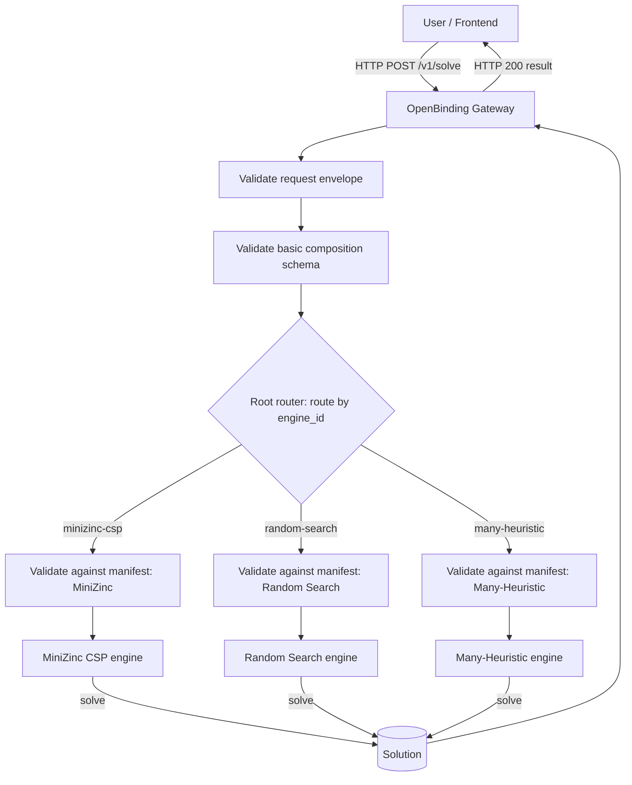

# OpenBinding

OpenBinding is a QoS-aware service composition gateway and solver engine framework. It provides a unified interface to model and solve service composition problems using various underlying optimization engines.

> Looking for **OpenBinding4Placement**? See the full documentation and experimental pipeline in [`experimentation/icsoc/README.md`](experimentation/icsoc/README.md).

## 🏗️ Architecture



## 🧩 Components

1.  **OpenBinding Gateway** (`openbinding-gateway`):
    *   Python FastAPI service acting as the central entry point.
    *   Handles schema validation (general schema, then the engine's manifest).
    *   Routes requests to appropriate engines.
    *   Provides analysis and diagnostics tools.

2.  **MiniZinc CSP Engine** (`engines/minizinc-csp`):
    *   TypeScript/Node.js service.
    *   Transforms problems into MiniZinc models.
    *   Solves using the Gecode constraint solver.
    *   Best for exact solutions to smaller/medium problems.

3.  **Random Search Engine** (`engines/random-search`):
    *   Java service.
    *   Uses random search (seeded and reproducible on the BIM′ path).
    *   Best for exploring large solution spaces; serves as the experimental baseline.

4.  **Many-Heuristic Engine** (`engines/many-heuristic`):
    *   Java service (extends Random Search).
    *   Specialized for **Many-Objective** problems (3+ objectives).
    *   Returns a **Pareto front** of non-dominated solutions.

5.  **Evolutionary Heuristics Engine** (`engines/evolutionary-heuristics`):
    *   Java service built on jMetal (NSGA-II / NSGA-III).
    *   MONO mode folds Deb's feasibility rules into the scalar objective and
        tracks the best individual ever evaluated (anytime behavior).

6.  **Frontend** (`frontend`):
    *   React + Vite web UI for modeling and submitting problems.
    *   Multi-page SPA with professional design inspired by modern developer tools.
    *   **Features**:
        - **Home**: Landing page showcasing OpenBinding features and engines
        - **Playground**: Interactive workspace with JSON editor, engine selector, and result
          visualization. The instance can be edited as one document or **by component of the
          tuple** — one editor per part, grouped into `M_A`, `M'_C`, `Δ` and `O` — which is how a
          reusable instance is written and stored (`examples/placement/parts/`). Switching
          between the two views goes through `POST /v1/instance/split` and `/compose`, so the
          gateway stays the only place that knows which key belongs to which part.
        - **Engines Explorer**: Browse and compare solver engines with capabilities
        - **Schema Explorer**: Interactive JSON schema viewer with search and navigation
        - **Light/Dark Theme**: System-aware theme with persistence

## 📐 Schemas & Specification

OpenBinding validates incoming requests against two schema layers:

1. **General schema** (engine-agnostic), one file per element of the tuple
   `I' = (M_A, M'_C, Δ, O)` so that a model can be referenced and reused on its own:
    - Root, composing the rest by `$ref`: `schemas/general/schema.json`
    - `application-model.schema.json` — `M_A = (T, G, Λ)`: tasks, orchestration, aggregation policies
    - `candidate-model.schema.json` — `M'_C = (P, C, F, R, L)`: providers, candidates, features,
      node resources, network latency
    - `constraints.schema.json` — `Δ` · `objective.schema.json` — `O` · `common.schema.json` — shared primitives

    `GET /v1/schemas/general` serves them bundled into one self-contained document, so
    consumers see exactly what a monolithic file would have been.
    - Specification / semantics (human-readable): `schemas/general/schema.specification.md`

    The specification document explains the intent and semantics behind the JSON Schema, including:
    - The instance model (tasks, candidates, providers, features)
    - Workflow modeling (`composition` as structured tree or DAG)
    - QoS aggregation and normalization (`aggregation_policies`)
    - Constraints and objectives, plus invariants that require a second validation pass
    - Sharing: what one candidate serving several tasks costs (`candidates[*].task_ids`,
      `features[*].sharing`)
    - The authoring shorthands and the canonical form every engine sees (§12)

2. **Engine manifests** (what each engine declares about itself):
    - `schemas/manifests/minizinc-csp.manifest.json`
    - `schemas/manifests/random-search.manifest.json`
    - `schemas/manifests/many-heuristic.manifest.json`
    - `schemas/manifests/evolutionary-heuristics.manifest.json`

   A manifest is the single place an engine describes itself: its `type`
   (EXACT or HEURISTIC), its `capabilities`, an `options_schema` saying what it
   accepts in `options`, and an `instance_schema` restricting the general schema
   to the instances it will solve. `GET /v1/engines`, `GET /v1/schemas/{engine}`
   and `GET /v1/engines/{engine}/options/*` are all read from it, so an engine
   cannot advertise one thing and enforce another. Fetch a whole one with
   `GET /v1/engines/{engine_id}/manifest`.

   The same document describes a **federated engine** — somebody else's solver,
   registered at runtime — which additionally carries a `transport` block saying
   where it lives and how to speak to it.

Example payloads that follow these schemas live in `examples/`.

### Placement extension (OpenBinding4Placement)

**OpenBinding4Placement** is the placement-aware extension of OpenBinding used to solve
**CLASP-FaaS** — the Cost- and Latency-Aware Secure Placement of FaaS Compositions — by
formulating it as a placement-aware QACO problem (QACO′).

Placement is **not a separate problem or a separate schema**: `resource_model` and
`latency_model` are optional blocks of the general schema. An instance that omits them is a
plain binding problem; an instance that provides them adds constraints over the very same
decisions, and engines that support them take them into account natively. The blocks add
**placement semantics** for FaaS-orchestration binding over the Cloud-Edge continuum:

- **`resource_model`** — infrastructure pools with capacities, per-candidate pool bindings and
  resource demands, and `RESOURCE_CAPACITY` constraints (cumulative bin-packing per node,
  counting each distinct selected candidate once).
- **`latency_model`** — a pool-to-pool latency matrix, event generators, pairwise transition
  latency bounds, and an end-to-end latency attribute defined as the **expected makespan over the
  XOR scenarios** of the composition (critical-path scheduling on the precedence DAG).
- **Canonical normalization** — per-feature min–max bounds embedded in the instance
  (`aggregation_policies.<id>.normalize`), so every engine optimizes and reports the same
  normalized weighted objective. Declaring it for every objective target is what selects the
  canonical objective — a weighted mean of per-feature losses, lower is better — independently
  of whether the instance carries placement blocks. Instances that declare none keep the plain
  weighted sum of normalized goodness, where higher is better.
- **Dependency extensions** — `SAME_POOL` / `DIFFERENT_POOL` co-location constraints, which
  require a `resource_model` declaring pools, and `SAME_CANDIDATE` / `DIFFERENT_CANDIDATE`,
  which say whether two tasks must be served by the very same thing.
- **Sharing** — a candidate lists every task it can implement (`task_ids`), so one deployment
  over three pools is three candidates rather than one per (task, pool) pair. When the same
  candidate is selected for k tasks, a feature declared `"sharing": "DIVIDE"` is split between
  them (`v/k` each, so the binding pays `v` once) while every other feature is charged in full
  to each, and its resource demand is taken up once on its pool.

The reference implementation of these semantics lives in the gateway
(`openbinding_gateway/semantics/`, one module per element of the tuple); solutions of instances
that declare canonical normalization are re-evaluated against it. All engines support shared **wall-clock time budgets** (`time_budget_ms`) with anytime
best-so-far traces; the exact engine additionally reports its incumbent trace and completion status
(`OPTIMAL` / `SATISFIED` / `UNSATISFIABLE` / `UNKNOWN`).

## 🔬 Experimentation

The OpenBinding4Placement experimental campaign — solving CLASP-FaaS as QACO′ (dataset
transformation, priced BIM′ corpus, campaign runner and evaluation notebooks) — is documented in
[`experimentation/icsoc/README.md`](experimentation/icsoc/README.md), supporting the paper
*QoS-aware Placement of FaaS Compositions in the Cloud-Edge Continuum*.

## 🚀 Getting Started

### Prerequisites

*   **Docker** and **Docker Compose**
*   (Optional) Python 3.11+ for local development

### Installation & Running

1.  **Configure environment variables**:
    ```bash
    cp .env.example .env
    ```

2.  **Start development stack**:
    ```bash
    COMPOSE_PROFILES=dev docker compose up --build
    ```

    Development services:
    *   **Nginx (local)**: [http://localhost:80](http://localhost:80)
    *   **Frontend dev server**: [http://localhost:5173](http://localhost:5173)
    *   **Gateway API docs**: [http://localhost:8000/docs](http://localhost:8000/docs)

3.  **Start production stack**:
    ```bash
    COMPOSE_PROFILES=prod docker compose up --build -d
    ```

    Production notes:
    *   **Nginx** listens on ports **80/443**.
    *   `frontend-prod` generates static assets; only Nginx serves them publicly.
    *   Place TLS files in `nginx/ssl/` (or override `NGINX_SSL_DIR`) with names:
        - `fullchain.pem`
        - `privkey.pem`
    *   Gateway is exposed only internally behind Nginx.
    *   Take into account that the production environment is currently configured for `openbinding.score.us.es` and `openbinding.us.es` domains (the domains where we are hosting the service in production). You may need to manually adjust nginx and docker compose configurations for your own domain or local testing.

4.  **Stop the Stack**:
    ```bash
    docker compose down
    ```

### 💻 Local Development (No Docker)

If you have the necessary runtimes installed (Python 3.11+, Node.js 20.19+, Maven, and a JDK: 8 or later builds random-search and many-heuristic, 21 is needed for evolutionary-heuristics), you can run the components locally for faster development:

1.  **Gateway** (Python):
    ```bash
    cd openbinding-gateway
    # Install dependencies with 'test' extras
    uv pip install -e ".[test]"
    # Run the gateway
    uvicorn openbinding_gateway.main:app --host 0.0.0.0 --port 8000
    ```

2.  **Frontend** (React + Vite):
    ```bash
    cd frontend
    # Install dependencies (requires Node.js 20.19+ or 22.12+)
    pnpm install
    # Set API URL (optional, defaults to http://localhost:8000)
    echo "VITE_API_BASE_URL=http://localhost:8000" > .env
    # Run development server
    pnpm run dev -- --host 0.0.0.0 --port 80
    ```
    The frontend will be available at [http://localhost:5173](http://localhost:5173)

3.  **MiniZinc CSP Engine** (Node.js + MiniZinc):
    - Requirements: [MiniZinc](https://www.minizinc.org/) installed and in system PATH.
    ```bash
    cd engines/minizinc-csp
    npm install
    npm run dev
    ```

4.  **JVM Engines** (Java + Maven):
    ```bash
    # The aggregator installs the shared core before the engines that need it
    cd engines
    mvn install

    # Then run one of them
    cd random-search
    mvn exec:java -Dexec.mainClass="es.us.isa.qosawarewsbinding.api.Server"
    ```

---

## 🛠️ Validation & Testing

OpenBinding implements a rigorous multi-stage validation process:
1.  **General Schema**: Ensures the input adheres to the simplified QoS specification structure.
2.  **Canonical form**: Expands the authoring shorthands (specification §12) once, in place, so
    every stage below and every engine reads one form only. An ambiguous shorthand is rejected
    here rather than guessed at.
3.  **Engine manifest**: Enforces engine-specific constraints (e.g., supported composition types, constraints), from the instance schema the engine declares.
4.  **Semantic/Logic**: Checks for consistency (e.g., undefined tasks, valid IDs).
5.  **Analysis**: Computes binding space cardinality and generates warnings for potential issues.

### Enhanced Validation Responses

The gateway now returns structured validation errors and warnings:

- **`/v1/analyze`**: Returns detailed warnings with `code`, `message`, and `details` (including `path`, `constraint_id`, `stage`)
- **`/v1/solve`**: Returns HTTP 422 on validation failure with structured violations in the same format

### Instances by component of the tuple

- **`/v1/instance/split`**: Takes a whole instance apart, returning one document per component
  of `I' = (M_A, M'_C, Δ, O)` and which model each belongs to — the same split the authoring
  tool (`openbinding-gateway/tools/bim_parts.py`) and `examples/placement/parts/` use.
- **`/v1/instance/compose`**: The inverse. A key given by two parts, or given to a part that
  does not own it, is a 422 rather than a silent overwrite.

Solving is unchanged: `/v1/solve` takes a whole instance, and composing is what produces one.

### Running Tests (Docker)

To run the complete test suite in the Docker environment:

```bash
# 1. Ensure stack is running
COMPOSE_PROFILES=dev docker compose up -d

# 2. Run all tests
docker compose exec gateway-dev test

# 3. Run specific test file
docker compose exec gateway-dev test tests/test_analysis.py -v
```

### Running Tests (Local)

If running **locally** without Docker:

```bash
cd openbinding-gateway
pytest
# Or run with verbose output
pytest -v
# Or run specific tests
pytest tests/test_validation_comprehensive.py -v
```

**Test Coverage**: 218 gateway unit tests plus 53 integration tests across all four
engines, 32 tests in the shared JVM core, 6 in each legacy engine, and 27 in the MiniZinc
engine - including snapshots that pin both the gateway's canonical output and the generated
MiniZinc data file.

```bash
cd openbinding-gateway && pytest              # unit tests
cd openbinding-gateway && pytest -m integration  # needs the compose stack up
cd engines && mvn test                        # shared core and the JVM engines
cd engines/minizinc-csp && pnpm test
```

## 📝 Usage Example

Submit a problem to the MiniZinc engine:

```bash
curl -X POST "http://localhost:8000/v1/solve" \
     -H "Content-Type: application/json" \
     -d '{
           "engine_id": "minizinc-csp",
           "verbose": true,
           "instance": { ... JSON content ... }
         }'
```

See `examples/` directory for sample payloads.

Two request flags are worth knowing:

- `"verbose": true` returns diagnostics and warnings, including the binding-space
  analysis.
- `"include_engine_report": true` returns, beside the canonical result, what the
  engine itself reported **before** the reference evaluator recomputed it: its
  solutions, its provenance, its untransformed body, and a divergence summary
  naming every solution where the two disagree. The official answer is always
  the canonical one; this is how a disagreement stops being invisible.

## 📜 The API as a contract

The gateway's own OpenAPI document is generated from the code, committed as
[docs/openapi.json](docs/openapi.json) and checked in CI, so a change to the
contract shows up in review. Browse it live at `/docs`.

There is a second, engine-side contract: `schemas/engine-contract.openapi.yaml`,
served at `/v1/schemas/engine-contract`, says what OpenBinding asks of an
engine — what it POSTs to `/solve`, the response shapes it accepts, and how it
polls a job. That is the document to implement against when writing a solver.

## 🧭 Engines

Every engine — the four in this repository and any registered later — declares
itself in one manifest: its type, its capabilities, the options it accepts and
the instances it will solve. Nothing is restated in code, so an engine cannot
advertise one thing and enforce another. Read one with
`GET /v1/engines/{engine_id}/manifest`.

An engine can arrive two ways, and neither asks you to write the manifest by
hand.

**In-tree** — it ships with the gateway. Scaffold the manifest, set
`ENGINE_<ID>_URL`, and that is the registration:

```bash
python openbinding-gateway/tools/new_engine.py my-engine --type HEURISTIC --nodes TASK SEQ --objectives MONO
```

A plugin is needed only for what a manifest cannot express — a request shape
that differs from the engine contract, or a check beyond a JSON Schema.

**Federated** — a solver you already run, registered at runtime through the API
and never deployed here. `POST /v1/engines/draft` reads your OpenAPI document
and proposes the whole manifest; registering it runs a conformance probe against
your engine and answers with a report naming any field to change. There is a
wizard at `/engines/new`.

Federation works because scoring stays here: the reference evaluator recomputes
every metric, so a third-party engine only has to return which candidate serves
which task, and its results are comparable with the built-in engines' by
construction rather than by trust. Solving on one sends the instance to its
owner's endpoint — the interface says so — and results are marked
`provenance.federated`.

- [docs/ENGINE_INTEGRATION_GUIDE.md](docs/ENGINE_INTEGRATION_GUIDE.md) — adding
  an engine, either way, end to end.
- [docs/ENGINE_MANIFEST.md](docs/ENGINE_MANIFEST.md) — the manifest reference:
  every field, its default, what is checked, and how to initialize one.

## 👤 Accounts, plans and quotas

Solving requires an account; analysing, browsing the schemas and reading the
plans do not. A browser session and an API key resolve to the same account, so a
plan applies to a person rather than to the way they called, and every operation
the interface performs is a documented gateway endpoint.

Entitlements are not decided by the gateway: a [SPACE](https://github.com/isa-group/space)
instance holds a contract per user and the gateway enforces its answer. A
deployment with no `DATABASE_URL` keeps serving anonymously, exactly as before.

- [docs/ACCOUNTS_AND_PLANS.md](docs/ACCOUNTS_AND_PLANS.md) — how accounts, plans,
  quotas and the first administrator work.
- [space/README.md](space/README.md) — running the SPACE instance and registering
  the pricing.
- [space/UPSTREAM.md](space/UPSTREAM.md) — defects found in SPACE and its Python
  client while integrating, with reproductions. Both run here unmodified.

## 🤝 Contributing

See [docs/CONTRIBUTING.md](docs/CONTRIBUTING.md) for branch and PR rules.

## 📄 License

This project is licensed under the **Creative Commons Attribution 4.0 International (CC BY 4.0)**.
See the [LICENSE](LICENSE) file for details.