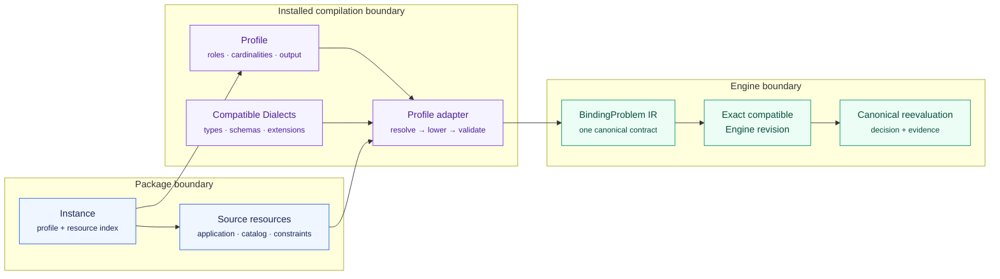

# OpenBinding

OpenBinding is a collaborative platform for describing, solving, comparing and
publishing binding and service-composition problems. **BIM v1** remains its
extensible language contract; the platform adds organizations, projects,
immutable case and resource revisions, collections, reproducible studies,
analysis, reports, administration and durable execution around the existing
compiler, registry, API and engines.

The platform deliberately keeps those layers separate:

- BIM packages compile through installed Profiles and Dialects into a canonical
  IR before any engine sees them.
- PostgreSQL owns users, collaboration, jobs, provenance and release metadata;
  Redis delivers durable work and one-use CAS state.
- SPHERE owns the immutable operational Pricing2Yaml versions under
  `OpenBinding/openbinding`; SPACE 1.5 owns contracts and usage accounting.
- Universidad de Sevilla CAS accounts receive the `RESEARCH` contract and a
  compact institutional mark. No identity is ever linked by email alone.

See the [interactive BIM v1 architecture map](docs/diagrams/bim-v1-architecture.html) for the package, compilation, and engine boundaries.

## BIM v1 at a glance



BIM follows the architectural idea that makes
[WS-Agreement](https://ogf.org/documents/GFD.107.pdf) useful across domains: a
small common container defines composition and extension contracts, while
versioned sublanguages supply the concrete service descriptions, conditions,
metrics, workflows, and objectives. BIM adopts that modularity, not
WS-Agreement's XML syntax, agreement protocol, negotiation lifecycle, or
runtime model.

An instance is rooted at `instance.json` and selects an installed Profile with
one compact field, for example `spec.profile: qos-binding/v1`. The Profile—not
the BIM core—declares the available roles, resource-type cardinalities, output
IR, capability vocabulary, limits vocabulary, and lowering adapter. Installed
Dialects contribute complete resource types or schema-pinned inline extension
points to those roles. This keeps independently authored application,
candidate, constraint, optimization, workflow, and placement modules
composable without enlarging the core language.

The only executable Profile shipped in v1 is `qos-binding/v1`. It defines the
roles `application`, `candidateCatalog`, `constraintSet`, and `optimization`.
Its JSON resources use `apiVersion: qos-binding/v1`; Placement is the separate
`qos-binding-placement/v1` sublanguage, and BPMN 2.0.2 is recognized by its XML
QName through an installed Dialect. QoS values are finite deterministic
scalars. Scheduling, probabilistic QoS, risk, telemetry, and runtime adaptation
are outside this Profile.

Git stores packages as readable directories. Transport uses deterministic
`.bim.zip` archives with `instance.json` as the root index. Compilation resolves
only installed, digest-pinned Profiles, Dialects, schemas, and adapters, then
emits the single IR declared by the Profile. Engines receive that IR—not source
files—and are selected by generic IR feature/capability compatibility.

## Running locally

```bash
./up.sh
```

For the complete collaborative stack, copy `.env.example`, set a signing
secret, and start the development profile. The optional `space` profile builds
the pinned SPACE 1.5 checkout prepared by `./space/prepare.sh`:

```bash
docker compose --profile dev up -d --build
./up.sh --with-space
```

The web application is available at `http://localhost`; the gateway publishes
its OpenAPI document at `http://localhost:8000/docs`. Adminer is an explicitly
local emergency tool and binds only to loopback:

```bash
docker compose --profile db-tools up -d adminer
```

### Seeding development data

To populate the database with a complete set of development entities (users, hierarchical organizations, projects, compiled BIM v1 cases, collections, real solver jobs, comparative studies, reports, publications, and API keys) for testing all platform features:

```bash
# Seed development data (idempotent: adds or updates without duplicating)
./tools/seed_dev.sh

# Or clean previously seeded entities and repopulate from scratch
./tools/seed_dev.sh --reset

# Directly through Docker Compose
docker compose exec -T gateway-dev python tools/seed_dev.py --reset
```

All test accounts (`alice`, `bob`, `carol`, `david`, `elena`, `frank`) use password: `devpass123`.
The administrator (`admin`) uses `devpass123` (or bootstrap password `4dm1n`).


The gateway exposes `/v1/profiles`, `/v1/dialects`, `/v1/resources`,
`/v1/engines`, `/v1/instances`, `/v1/jobs`, and
`/v1/engine-registrations`. BIM source uploads are complete `.bim.zip`
packages; JSON requests may refer to immutable snapshots. Jobs always return
`202`. Results use `OPTIMAL`, `FEASIBLE`, `INFEASIBLE`, or `UNKNOWN`, and
errors use `application/problem+json` with source-located diagnostics.

The React workbench is a single transactional `InstanceWorkspace` over the
same package and compiler contracts used by API clients. Its surrounding
platform shell adds the organization/project context, onboarding for new
accounts, cases, resources, collections, studies, public Explore surfaces,
authenticated Engine management (`/app/engines`) with owner telemetry, and
the SPHERE/SPACE pricing control room.

### Scientific Provenance, Deep Inspection & Replication

OpenBinding guarantees strict cryptographic immutability and provenance:
- **In-browser ZIP Uncompression & Inspection**: Explore `.bim.zip` snapshots and artifact archives directly in the browser with directory trees and syntax-highlighted code inspection via CodeMirror.
- **Dedicated Deep-Linked Views**: Full-page inspection and editing for Cases (`/cases/:caseSlug`), Snapshots (`/snapshots/:snapshotId`), Collections (`/collections/:collectionSlug`), Jobs (`/jobs/:jobId`), and Reports (`/reports/:reportSlug`).
- **Cryptographic Provenance Verifier (`/app/verifier`)**: Audits SHA-256 canonical digests of cases, snapshots, collections, reports, and artifacts via `POST /v1/verifier/inspect`, certifying reproducibility and generating scientific citations (BibTeX, DOI, Markdown badges).

## Repository layout

- `schemas/bim/v1`: BIM core, Profile, Dialect, IR, and bundled sublanguage
  contracts.
- `openbinding-gateway`: secure package handling, BIM compilation, registry,
  provenance, and the OpenBinding `/v1` API.
- `frontend`: the BIM Instance Workspace.
- `deploy`: plain Kustomize manifests, network policies and backup/restore
  runbooks; no Helm dependency.
- `space`: the exact SPACE 1.5 pin, bootstrap tooling and the reviewable first
  OpenBinding pricing release (`0.1.0`).
- `engines`: MiniZinc, random-search, many-heuristic, evolutionary modes, and
  the federated `multi-heuristic` example.
- `examples` and `experimentation`: BIM v1 packages and reproducible generators.

Start with the [progressive BIM model atlas](docs/models/README.md) for the
metamodels and concrete instances, continue with the
[BIM architecture](docs/BIM_V1.md), follow the
[authoring guide](docs/AUTHORING_GUIDE.md), or read the
[engine integration guide](docs/ENGINE_INTEGRATION.md).

For a complete external deployment example, see the
[`multi-heuristic` federation walkthrough](examples/federation/multi-heuristic/README.md).

The full platform, BIM, `qos-binding/v1`, extension and operations guides live
in the companion
[OpenBinding documentation repository](https://github.com/javiercavlop/OpenBinding-docs).

## Regression suites

The pull-request workflow compiles the complete checked-in BIM corpus, tests
every engine, runs the frontend unit and browser suites, and executes the real
gateway integration suite. With the Compose development stack running, the two
cross-version scientific regressions can also be repeated directly:

```bash
# The complete BPMN package and its native-JSON twin must compile to the same
# semantic IR and return identical solutions in every bundled/federated engine.
docker compose exec -T gateway-dev test \
  tests/integration/test_engine_representation_regression.py -m integration

# Regenerate mediaOrch/146588263/infrastructure_50, reproduce the historical
# MiniZinc optimum, and classify the seeded heuristic results.
docker compose exec -T gateway-dev test \
  tests/integration/test_icsoc_regression.py -m integration

# Ownership, private/public visibility, moderation and the admin-owned example.
docker compose exec -T gateway-dev test \
  tests/test_v1_lifecycle_rbac.py tests/test_federated_multi_heuristic_example.py
```
