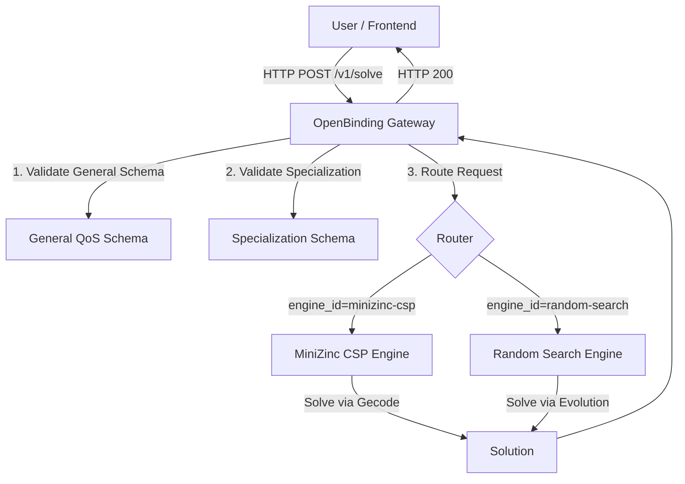

# OpenBinding

OpenBinding is a QoS-aware service composition gateway and solver engine framework. It provides a unified interface to model and solve service composition problems using various underlying optimization engines.

## 🏗️ Architecture



## 🧩 Components

1.  **OpenBinding Gateway** (`openbinding-gateway`):
    *   Python FastAPI service acting as the central entry point.
    *   Handles schema validation (General & Specialization).
    *   Routes requests to appropriate engines.
    *   Provides analysis and diagnostics tools.

2.  **MiniZinc CSP Engine** (`engines/minizinc-csp`):
    *   TypeScript/Node.js service.
    *   Transforms problems into MiniZinc models.
    *   Solves using the Gecode constraint solver.
    *   Best for exact solutions to smaller/medium problems.

3.  **Random Search Engine** (`engines/random-search`):
    *   Java service.
    *   Uses random search.
    *   Best for exploring large solution spaces.

4.  **Frontend** (`frontend`):
    *   React + Vite web UI for modeling and submitting problems.
    *   Multi-page SPA with professional design inspired by modern developer tools.
    *   **Features**:
        - **Home**: Landing page showcasing OpenBinding features and engines
        - **Playground**: Interactive workspace with JSON editor, engine selector, and result visualization
        - **Engines Explorer**: Browse and compare solver engines with capabilities
        - **Schema Explorer**: Interactive JSON schema viewer with search and navigation
        - **Light/Dark Theme**: System-aware theme with persistence

## 🚀 Getting Started

### Prerequisites

*   **Docker** and **Docker Compose**
*   (Optional) Python 3.11+ for local development

### Installation & Running

1.  **Start the Stack**:
    ```bash
    docker compose up --build
    ```

    The services will be available at:
    *   **Frontend**: [http://localhost:80](http://localhost:80)
    *   **Gateway API**: [http://localhost:8000/docs](http://localhost:8000/docs)
    *   **MiniZinc Engine**: Port 3000 (Internal)
    *   **Random Search Engine**: Port 8081 (Internal)

2.  **Stop the Stack**:
    ```bash
    docker compose down
    ```

### 💻 Local Development (No Docker)

If you have the necessary runtimes installed (Python 3.11+, Node.js 20.19+, Java 17+, and Maven), you can run the components locally for faster development:

1.  **Gateway** (Python):
    ```bash
    cd openbinding-gateway
    # Install dependencies with 'test' extras
    uv pip install -e ".[test]"
    # Run the gateway
    uvicorn openbinding_gateway.main:app --host 0.0.0.0 --port 8000
    ```

2.  **Frontend** (React + Vite):
    ```bash
    cd frontend
    # Install dependencies (requires Node.js 20.19+ or 22.12+)
    pnpm install
    # Set API URL (optional, defaults to http://localhost:8000)
    echo "VITE_API_BASE_URL=http://localhost:8000" > .env
    # Run development server
    pnpm run dev -- --host 0.0.0.0 --port 80
    ```
    The frontend will be available at [http://localhost:5173](http://localhost:5173)

3.  **MiniZinc CSP Engine** (Node.js + MiniZinc):
    - Requirements: [MiniZinc](https://www.minizinc.org/) installed and in system PATH.
    ```bash
    cd engines/minizinc-csp
    npm install
    npm run dev
    ```

4.  **Random Search Engine** (Java + Maven):
    ```bash
    cd engines/random-search
    # Build and run
    mvn compile exec:java -Dexec.mainClass="es.us.isa.qosawarewsbinding.Controller"
    ```

---

## 🛠️ Validation & Testing

OpenBinding implements a rigorous multi-stage validation process:
1.  **General Schema**: Ensures the input adheres to the simplified QoS specification structure.
2.  **Specialization Schema**: Enforces engine-specific constraints (e.g., supported composition types, constraints).
3.  **Semantic/Logic**: Checks for consistency (e.g., undefined tasks, valid IDs).
4.  **Analysis**: Computes binding space cardinality and generates warnings for potential issues.

### Enhanced Validation Responses

The gateway now returns structured validation errors and warnings:

- **`/v1/analyze`**: Returns detailed warnings with `code`, `message`, and `details` (including `path`, `constraint_id`, `stage`)
- **`/v1/solve`**: Returns HTTP 422 on validation failure with structured violations in the same format

### Running Tests (Docker)

To run the complete test suite in the Docker environment:

```bash
# 1. Ensure stack is running
docker compose up -d

# 2. Run all tests
docker compose exec gateway test

# 3. Run specific test file
docker compose exec gateway test tests/test_analysis.py -v
```

### Running Tests (Local)

If running **locally** without Docker:

```bash
cd openbinding-gateway
pytest
# Or run with verbose output
pytest -v
# Or run specific tests
pytest tests/test_validation_comprehensive.py -v
```

**Test Coverage**: 60 tests covering validation, analysis, routing, and integration with engines.

## 📝 Usage Example

Submit a problem to the MiniZinc engine:

```bash
curl -X POST "http://localhost:8000/v1/solve" \
     -H "Content-Type: application/json" \
     -d '{
           "engine_id": "minizinc-csp",
           "verbose": true,
           "instance": { ... JSON content ... }
         }'
```

See `examples/` directory for sample payloads.

## 📄 License

This project is licensed under the **Creative Commons Attribution 4.0 International (CC BY 4.0)**.
See the [LICENSE](LICENSE) file for details.