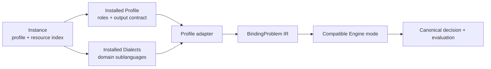

# OpenBinding

OpenBinding is the reference platform for **BIM v1**, an extensible language
framework for service-composition and binding problems. BIM is the language;
OpenBinding supplies its compiler, registry, Playground, HTTP API, and engines.

## BIM v1 at a glance



BIM follows the architectural idea that makes
[WS-Agreement](https://ogf.org/documents/GFD.107.pdf) useful across domains: a
small common container defines composition and extension contracts, while
versioned sublanguages supply the concrete service descriptions, conditions,
metrics, workflows, and objectives. BIM adopts that modularity, not
WS-Agreement's XML syntax, agreement protocol, negotiation lifecycle, or
runtime model.

An instance is rooted at `instance.json` and selects an installed Profile with
one compact field, for example `spec.profile: qos-binding/v1`. The Profile—not
the BIM core—declares the available roles, resource-type cardinalities, output
IR, capability vocabulary, limits vocabulary, and lowering adapter. Installed
Dialects contribute complete resource types or schema-pinned inline extension
points to those roles. This keeps independently authored application,
candidate, constraint, optimization, workflow, and placement modules
composable without enlarging the core language.

The only executable Profile shipped in v1 is `qos-binding/v1`. It defines the
roles `application`, `candidateCatalog`, `constraintSet`, and `optimization`.
Its JSON resources use `apiVersion: qos-binding/v1`; Placement is the separate
`qos-binding-placement/v1` sublanguage, and BPMN 2.0.2 is recognized by its XML
QName through an installed Dialect. QoS values are finite deterministic
scalars. Scheduling, probabilistic QoS, risk, telemetry, and runtime adaptation
are outside this Profile.

Git stores packages as readable directories. Transport uses deterministic
`.bim.zip` archives with `instance.json` as the root index. Compilation resolves
only installed, digest-pinned Profiles, Dialects, schemas, and adapters, then
emits the single IR declared by the Profile. Engines receive that IR—not source
files—and are selected by generic IR feature/capability compatibility.

## Running locally

```bash
./up.sh
```

The gateway exposes `/v1/profiles`, `/v1/dialects`, `/v1/resources`,
`/v1/engines`, `/v1/instances`, `/v1/jobs`, and
`/v1/engine-registrations`. BIM source uploads are complete `.bim.zip`
packages; JSON requests may refer to immutable snapshots. Jobs always return
`202`. Results use `OPTIMAL`, `FEASIBLE`, `INFEASIBLE`, or `UNKNOWN`, and
errors use `application/problem+json` with source-located diagnostics.

The React Playground is a single transactional `InstanceWorkspace` over the
same package and compiler contracts used by API clients.

## Repository layout

- `schemas/bim/v1`: BIM core, Profile, Dialect, IR, and bundled sublanguage
  contracts.
- `openbinding-gateway`: secure package handling, BIM compilation, registry,
  provenance, and the OpenBinding `/v1` API.
- `frontend`: the BIM Instance Workspace.
- `engines`: MiniZinc, random-search, many-heuristic, evolutionary modes, and
  the federated `multi-heuristic` example.
- `examples` and `experimentation`: BIM v1 packages and reproducible generators.

Start with the [progressive BIM model atlas](docs/models/README.md) for the
metamodels and concrete instances, continue with the
[BIM architecture](docs/BIM_V1.md), follow the
[authoring guide](docs/AUTHORING_GUIDE.md), or read the
[engine integration guide](docs/ENGINE_INTEGRATION.md).

For a complete external deployment example, see the
[`multi-heuristic` federation walkthrough](examples/federation/multi-heuristic/README.md).

## Regression suites

The pull-request workflow compiles the complete checked-in BIM corpus, tests
every engine, runs the frontend unit and browser suites, and executes the real
gateway integration suite. With the Compose development stack running, the two
cross-version scientific regressions can also be repeated directly:

```bash
# The complete BPMN package and its native-JSON twin must compile to the same
# semantic IR and return identical solutions in every bundled/federated engine.
docker compose exec -T gateway-dev test \
  tests/integration/test_engine_representation_regression.py -m integration

# Regenerate mediaOrch/146588263/infrastructure_50, reproduce the historical
# MiniZinc optimum, and classify the seeded heuristic results.
docker compose exec -T gateway-dev test \
  tests/integration/test_icsoc_regression.py -m integration

# Ownership, private/public visibility, moderation and the admin-owned example.
docker compose exec -T gateway-dev test \
  tests/test_v1_lifecycle_rbac.py tests/test_federated_multi_heuristic_example.py
```
