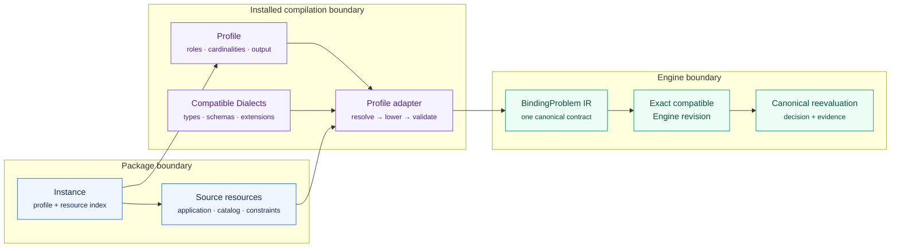

# OpenBinding

OpenBinding is to QoS-aware service binding and composition problems what
[SPHERE](https://sphere.score.us.es) is to SaaS pricings: a **repository** of
versioned, citable binding problems, a **collaborative analysis** platform and a
**laboratory** that compares interchangeable engines reproducibly. Problems are
written in **BIM v1**, the Binding Instance Model, an extensible language whose
profiles and dialects compile every problem to one canonical IR; the gateway
re-evaluates every engine answer so results are comparable and verifiable by
digest. Vision and scope: [`INTENT.md`](INTENT.md); target architecture:
[`docs/ARCHITECTURE.md`](docs/ARCHITECTURE.md); plan: [`ROADMAP.md`](ROADMAP.md).

Its layers stay deliberately separate:

- BIM packages compile through installed Profiles and Dialects into a canonical
  IR before any engine sees them.
- PostgreSQL owns users, collaboration, jobs, provenance and release metadata;
  Redis delivers durable work and one-use CAS state.
- OpenBinding's own pricing lives in SPHERE and is operated by SPACE, which
  follows SPHERE's permanent link. OpenBinding talks to SPACE only through its
  official clients (`space-python-client`, `space-react-client`), reads SPHERE
  only through its public API and renders pricings with `pricing-renderer`
  (ADR-0015). It has no pricing editor or contract console of its own.
- Nothing is metered or charged: there are no credits or compute units, and the
  only execution limit that is not a plan entitlement is a technical
  per-account concurrency cap (`MAX_CONCURRENT_JOBS_PER_USER`, answered with
  `429 concurrency_limit_exceeded`). The former automatic Engine selection was
  retired and has no replacement.
- Universidad de Sevilla CAS accounts receive the `RESEARCH` contract and a
  compact institutional mark. No identity is ever linked by email alone.

For the layers of the gateway today and the BIM/platform boundary, see
[`docs/architecture/gateway-as-is.md`](docs/architecture/gateway-as-is.md); for the guarantees of job
submission and execution, [`docs/IDEMPOTENCY.md`](docs/IDEMPOTENCY.md); for the
current state of the work, [`docs/qa/JOINT_STATUS.md`](docs/qa/JOINT_STATUS.md).

See the [interactive BIM v1 architecture map](docs/diagrams/bim-v1-architecture.html) for the package, compilation, and engine boundaries.

## Project governance

Agents and contributors start at [`AGENTS.md`](AGENTS.md). Purpose and rules: [`INTENT.md`](INTENT.md), [`docs/ARCHITECTURE.md`](docs/ARCHITECTURE.md), [`ROADMAP.md`](ROADMAP.md), [`constitution.md`](constitution.md), [`REVIEW.md`](REVIEW.md), [`CONTRIBUTING.md`](CONTRIBUTING.md), [`TESTING.md`](TESTING.md), [`SECURITY.md`](SECURITY.md), [Definition of Done](docs/DEFINITION_OF_DONE.md); living specs in [`openspec/`](openspec/project.md); decisions in [`docs/adr/`](docs/adr/0001-record-architecture-decisions.md).

## BIM v1 at a glance


```mermaid
flowchart LR
  subgraph Source["Package boundary"]
    I["Instance<br/><small>profile + resource index</small>"]
    R["Source resources<br/><small>application · catalog · constraints</small>"]
  end
  subgraph Compile["Installed compilation boundary"]
    P["Profile<br/><small>roles · cardinalities · output</small>"]
    D["Compatible Dialects<br/><small>types · schemas · extensions</small>"]
    C["Profile adapter<br/><small>resolve → lower → validate</small>"]
  end
  subgraph Execute["Engine boundary"]
    IR["BindingProblem IR<br/><small>one canonical contract</small>"]
    E["Exact compatible<br/>Engine revision"]
    V["Canonical reevaluation<br/><small>decision + evidence</small>"]
  end
  I --> P
  I --> R
  P & D & R --> C
  C --> IR --> E --> V
  classDef package fill:#eff6ff,stroke:#2563eb,color:#172554
  classDef compile fill:#f5f3ff,stroke:#7c3aed,color:#4c1d95
  classDef execute fill:#ecfdf5,stroke:#059669,color:#064e3b
  class I,R package
  class P,D,C compile
  class IR,E,V execute
```

BIM follows the architectural idea that makes
[WS-Agreement](https://ogf.org/documents/GFD.107.pdf) useful across domains: a
small common container defines composition and extension contracts, while
versioned sublanguages supply the concrete service descriptions, conditions,
metrics, workflows, and objectives. BIM adopts that modularity, not
WS-Agreement's XML syntax, agreement protocol, negotiation lifecycle, or
runtime model.

An instance is rooted at `instance.json` and selects an installed Profile with
one compact field, for example `spec.profile: qos-binding/v1`. The Profile—not
the BIM core—declares the available roles, resource-type cardinalities, output
IR, capability vocabulary, limits vocabulary, and lowering adapter. Installed
Dialects contribute complete resource types or schema-pinned inline extension
points to those roles. This keeps independently authored application,
candidate, constraint, optimization, workflow, and placement modules
composable without enlarging the core language.

The only executable Profile shipped in v1 is `qos-binding/v1`. It defines the
roles `application`, `candidateCatalog`, `constraintSet`, and `optimization`.
Its JSON resources use `apiVersion: qos-binding/v1`; Placement is the separate
`qos-binding-placement/v1` sublanguage, and BPMN 2.0.2 is recognized by its XML
QName through an installed Dialect. QoS values are finite deterministic
scalars. Scheduling, probabilistic QoS, risk, telemetry, and runtime adaptation
are outside this Profile.

Git stores packages as readable directories. Transport uses deterministic
`.bim.zip` archives with `instance.json` as the root index. Compilation resolves
only installed, digest-pinned Profiles, Dialects, schemas, and adapters, then
emits the single IR declared by the Profile. Engines receive that IR—not source
files—and are selected by generic IR feature/capability compatibility.

## Running locally

```bash
./up.sh
```

For the complete collaborative stack, copy `.env.example`, set a signing
secret, and start the development profile. SPACE (`https://space.score.us.es`)
and SPHERE are remote services configured through `SPACE_URL`/`SPACE_API_KEY`
(`MANAGEMENT` scope) and `SPHERE_*` in `.env` (`SPACE_ENABLED` and
`SPHERE_ENABLED` are `false` in `.env.example`); no copy of them is deployed
locally and they are administered in their native UIs:

```bash
docker compose --profile dev up -d --build     # development
docker compose --profile prod up -d --build    # production images behind nginx
```

`docker-compose.yml` defines the profiles `dev`, `prod`, `db-tools` (Adminer),
`federated-example` and `benchmark`. `dev` and `prod` start PostgreSQL, Redis,
the gateway, the analysis worker, the four bundled Engines, the frontend and
nginx. With `APP_ENV=prod` the gateway refuses to start unless
`CORS_ALLOW_ORIGINS` names exact origins. Whether the stack, SPACE and SPHERE
work together end to end against the real remote services has not been
exercised yet; see [`docs/qa/JOINT_STATUS.md`](docs/qa/JOINT_STATUS.md).

**Development scope.** The development pricing and the development service
registered in SPACE are private and distinct from the production ones, but
they live inside the *same organizations*. A shared organization does **not**
isolate credentials: a development `SPACE_API_KEY` or `SPHERE_API_KEY` with
`MANAGEMENT` scope can act on whatever that organization holds, so treat it as
a high-risk secret, keep it out of images, logs and the browser, and never reuse
a production key for development.

The web application is available at `http://localhost`; the gateway publishes
its OpenAPI document at `http://localhost:8000/docs`. Adminer is an explicitly
local emergency tool and binds only to loopback:

```bash
docker compose --profile db-tools up -d adminer
```

The versioned-artifact schema is a development cutover and cannot migrate a
pre-cutover PostgreSQL volume because doing so would discard historical rows.
If `gateway-dev` exits during Alembic with `Rebuild the local development
database`, recreate only the local PostgreSQL volume and start the stack again:

```bash
docker compose stop postgres
docker compose rm -f postgres
docker volume rm openbinding_pgdata
./up.sh
```

The volume name follows the Compose project name; use
`docker volume ls --format '{{.Name}}'` if `COMPOSE_PROJECT_NAME` is set. This
procedure leaves Redis, artifacts and other development volumes intact.

### Seeding development data

To populate the database with a complete set of development entities (users, hierarchical organizations, projects, compiled BIM v1 cases, collections, real solver jobs, comparative studies, reports, publications, and API keys) for testing all platform features:

```bash
# Seed development data (idempotent: adds or updates without duplicating)
./tools/seed_dev.sh

# Or clean previously seeded entities and repopulate from scratch
./tools/seed_dev.sh --reset

# Add/update only the interactive binding-analysis examples (existing dev data)
./tools/seed_dev.sh --analysis-only

# Full binding decision validation with live jobs and up to 100,000 unique bindings
./tools/seed_dev.sh --analysis-full

# Directly through Docker Compose
docker compose exec -T gateway-dev python tools/seed_dev.py --reset
```

The integrated [binding decision workspace](docs/analysis/binding-decision-workspace.md) documents the evidence contract, geometric views, limits, scenario coverage and reproducible API/browser checks. Population writes `openbinding-gateway/tools/analysis-manifest.json` with analysis and draft Report links.

All test accounts (`alice`, `bob`, `carol`, `david`, `elena`, `frank`) use password: `devpass123`.
The administrator (`admin`) uses `devpass123`.

The gateway ships no default administrator. To start with one, set
`BOOTSTRAP_ADMIN_USERNAME` and `BOOTSTRAP_ADMIN_PASSWORD` in `.env`, or opt in
with `SEED_DEFAULT_ADMIN=true` plus `BOOTSTRAP_ADMIN_PASSWORD` to get an `admin`
account in an empty database. The `dev` profile publishes the gateway on
`127.0.0.1:8000` only, so it is not reachable from other machines.


The gateway exposes `/v1/profiles`, `/v1/dialects`, `/v1/resources`,
`/v1/engines`, `/v1/instances`, `/v1/jobs`, `/v1/generator`, and
`/v1/engine-registrations`. BIM source uploads are complete `.bim.zip`
packages; JSON requests may refer to immutable snapshots. Jobs always return
`202`. Results use `OPTIMAL`, `FEASIBLE`, `INFEASIBLE`, or `UNKNOWN`, and
errors use `application/problem+json` with source-located diagnostics.

The React workbench is a single transactional `InstanceWorkspace` over the
same package and compiler contracts used by API clients. Its surrounding
platform shell adds the organization/project context, onboarding for new
accounts, cases, resources, collections, studies, public Explore surfaces,
authenticated Engine management (`/app/engines`) with owner telemetry. Pricing
is managed in the remote SPHERE and SPACE UIs, not in OpenBinding.

### Scientific Provenance, Deep Inspection & Replication

OpenBinding guarantees strict cryptographic immutability and provenance:
- **In-browser ZIP Uncompression & Inspection**: Explore `.bim.zip` snapshots and artifact archives directly in the browser with directory trees and syntax-highlighted code inspection via CodeMirror.
- **Report editions**: Report drafts and sealed versions share the artifact library. Publications pin an exact version; withdrawal retains its citation and evidence.
- **Versioned study definitions**: Projects can share an exact library Study version and adopt updates independently. Runs retain their original version and matrix; archive/restore preserves execution history. See the [artifact lifecycle and migration status](docs/VERSIONED_ARTIFACTS.md).
- **Dedicated Deep-Linked Views**: Full-page inspection and editing for Cases (`/cases/:caseSlug`), Snapshots (`/snapshots/:snapshotId`), Collections (`/collections/:collectionSlug`), Jobs (`/jobs/:jobId`), and Reports (`/reports/:reportSlug`).
- **Cryptographic Provenance Verifier (`/app/verifier`)**: Audits SHA-256 canonical digests of cases, snapshots, collections, reports, and artifacts via `POST /v1/verifier/inspect`, checking retained content and generating citation metadata. A digest alone does not certify authorship or numerical reproducibility.

## Repository layout

- `schemas/bim/v1`: BIM core, Profile, Dialect, IR, and bundled sublanguage
  contracts.
- `openbinding-gateway`: secure package handling, BIM compilation, registry,
  provenance, and the OpenBinding `/v1` API.
- `frontend`: the BIM Instance Workspace.
- `bim-toolchain`: self-contained directory being extracted into its own
  private repository (`javiercavlop/bim-toolchain`; the remote has not been
  created). See [BIM extraction status](#bim-extraction-status).
- `space`: only the pricing fixture (`space/pricing/openbinding.yml`); SPACE
  itself is remote.
- `pricings`: third-party FaaS pricing documents (AWS, Azure, Google Cloud)
  that BIM experiments analyse. They are **not** OpenBinding plans; see
  [`pricings/README.md`](pricings/README.md).
- `engines`: MiniZinc, random-search, many-heuristic, evolutionary modes,
  `bim-generator`, and the federated `multi-heuristic` example.
- `examples` and `experimentation`: BIM v1 packages and reproducible generators.

### BIM extraction status

BIM is being extracted into `bim-toolchain/`, planned as three parts: `bim-core`
(compilation and evaluation), `bim-service` (an HTTP API under `/bim/v1`) and
`bim-client` (a `BimPort` with in-process and HTTP implementations). In this
tree only `bim-toolchain/packages/bim-core` exists (see
[`bim-toolchain/README.md`](bim-toolchain/README.md)); no `bim-service` or
`bim-client` directory was found, so they are not described here as available.
**Transitional state:** until the cut-over, OpenBinding still compiles and
evaluates with its own copy under `openbinding-gateway/src/openbinding_gateway/v1`
and does not depend on `bim-toolchain`. See [BIM core](docs/BIM_CORE.md).

**OMG BPMN XSDs.** The five OMG BPMN 2.0.2 XML Schemas (`BPMN20.xsd`, `Semantic.xsd`, `BPMNDI.xsd`, `DC.xsd`, `DI.xsd`) under
`bim-toolchain/packages/bim-core/src/bim_core/resources/vendor/omg/bpmn/2.0.2/` are **not versioned in Git** (their
redistribution is not demonstrated: [`bim-toolchain/docs/OMG_XSD_RIGHTS.md`](bim-toolchain/docs/OMG_XSD_RIGHTS.md)). The system
behaves as if they were inside: wherever they are missing they are downloaded from omg.org over https and the SHA-256 of
each is verified (all five or an error; nothing is written otherwise). The build hook of `bim-core`
(`bim-toolchain/packages/bim-core/hatch_build.py`) does it for `uv sync`, `pip install` and `-e`; the Docker images
(`openbinding-gateway`, `bim-service`, `experimentation/qacobench`), the CI jobs, the test sessions and the tools do it too.
Without network the error names the exact command, `python3 bim-toolchain/tools/xsd_inventory.py --ensure` from this directory.
`python3 bim-toolchain/tools/xsd_inventory.py --check` fails if Git lists the files or does not ignore them. Wheels,
sdists, the SDK and the images do carry the files; keeping them in the artifacts is a decision of the owner.

Start with the [progressive BIM model atlas](docs/models/README.md) for the
metamodels and concrete instances, continue with the
[BIM architecture](docs/BIM_V1.md), explore the
[BIM generator](docs/BIM_GENERATOR.md), follow the
[authoring guide](docs/AUTHORING_GUIDE.md), or read the
[engine integration guide](docs/ENGINE_INTEGRATION.md).

For a complete external deployment example, see the
[`multi-heuristic` federation walkthrough](examples/federation/multi-heuristic/README.md).

The full platform, BIM, `qos-binding/v1`, extension and operations guides live
in the companion
[OpenBinding documentation repository](https://github.com/javiercavlop/OpenBinding-docs).

## Regression suites

The pull-request workflow compiles the complete checked-in BIM corpus, tests
every engine, runs the frontend unit and browser suites, and executes the real
gateway integration suite. With the Compose development stack running, the two
cross-version scientific regressions can also be repeated directly:

```bash
# The complete BPMN package and its native-JSON twin must compile to the same
# semantic IR and return identical solutions in every bundled/federated engine.
docker compose exec -T gateway-dev test \
  tests/integration/test_engine_representation_regression.py -m integration

# Regenerate mediaOrch/146588263/infrastructure_50, reproduce the historical
# MiniZinc optimum, and classify the seeded heuristic results. Needs the ICSOC
# source dataset from the data/icsoc-original-dataset branch (see
# experimentation/icsoc/README.md); the test is skipped without it.
docker compose exec -T gateway-dev test \
  tests/integration/test_icsoc_regression.py -m integration

# Ownership, private/public visibility, moderation and the admin-owned example.
docker compose exec -T gateway-dev test \
  tests/test_v1_lifecycle_rbac.py tests/test_federated_multi_heuristic_example.py
```

The [versioned artifact library](docs/VERSIONED_ARTIFACTS.md) documents the organization-scoped lifecycle, exact references, case composition and migration status. Project resource and collection endpoints delegate to the same library; `/blobs` stores bytes and `/v1/artifacts` exposes editorial identities.
