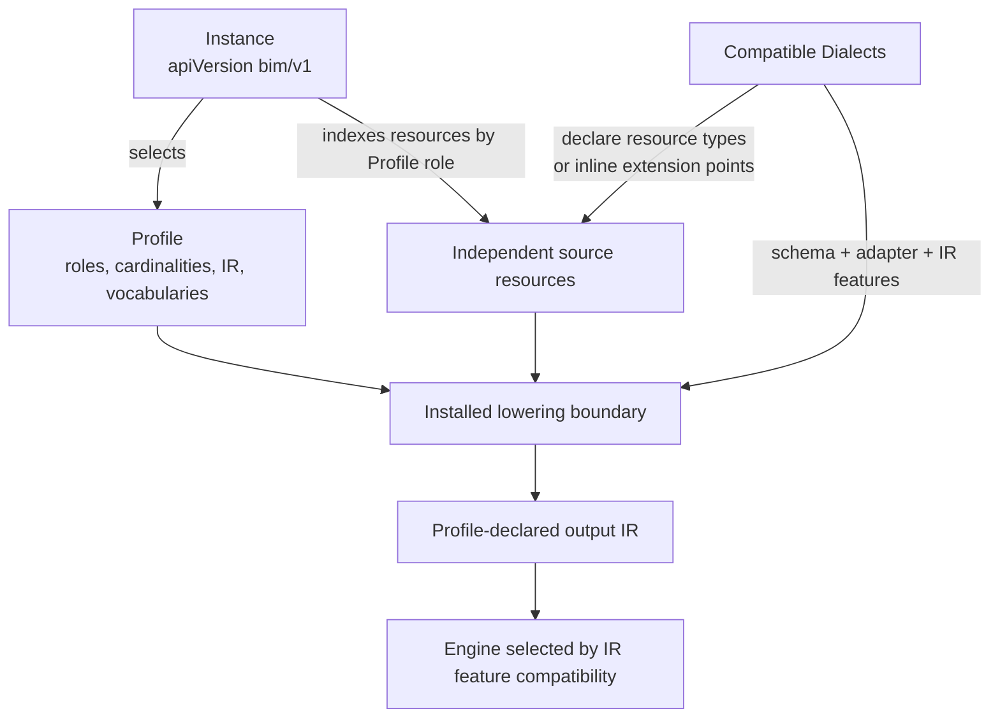

# BIM v1: an extensible binding-language framework

BIM v1 is a language container for service-composition and binding problems.
It is not one monolithic QoS document. A small BIM core selects a **Profile**
and indexes independently versioned resources; Profiles define problem-family
contracts, while **Dialects** provide the concrete vocabularies that inhabit
those contracts.

The architecture is intentionally inspired by
[WS-Agreement](https://ogf.org/documents/GFD.107.pdf). WS-Agreement is valuable
as a common agreement/SLA structure whose service-description terms,
guarantee terms, expressions, metrics, and domain concepts can come from other
namespaced schema languages. BIM inherits that separation of stable container
semantics from replaceable domain sublanguages and applies it to composition
and binding.

BIM does **not** adopt WS-Agreement's XML document format, agreement offer or
template protocol, party negotiation, agreement lifecycle, monitoring, or
runtime guarantee enforcement. It borrows an architectural principle, not a
wire protocol.

## The container boundary



The BIM core owns only the reusable mechanics:

- the strict `apiVersion`/`kind`/`metadata`/`spec` envelope for BIM JSON
  control resources;
- the `Instance` profile selector and role-indexed resource map;
- local and immutable registered-resource references;
- Profile, Dialect, Engine, and EngineRegistration manifests;
- secure package transport, canonicalization, digests, diagnostics, and
  provenance.

The core does not define what an application, candidate, SLO, metric,
condition, workflow, or objective must look like. Those concepts belong to a
selected Profile and its compatible Dialects. Consequently, adding a service
term or condition language does not add fields to `Instance`; it adds a
versioned, schema-pinned module with an installed adapter.

## Instance: a small, profile-directed index

A Git checkout stores an instance as a readable directory. Its portable form
is a deterministic `.bim.zip`, rooted at `instance.json`:

```json
{
  "apiVersion": "bim/v1",
  "kind": "Instance",
  "metadata": {"name": "checkout"},
  "spec": {
    "profile": "qos-binding/v1",
    "resources": {
      "application": {
        "application": "application.json"
      },
      "candidateCatalog": {
        "catalog": "candidates.json"
      },
      "constraintSet": {
        "policy": "constraints.json"
      },
      "optimization": {
        "goal": "optimization.json"
      }
    }
  }
}
```

`spec.profile` is deliberately compact. The compiler resolves the complete
installed Profile manifest and its adapter, then pins both in the IR and job
provenance. `spec.resources` is generic: its keys are validated against the
roles declared by that Profile, rather than against role names embedded in the
BIM core.

For the only executable v1 Profile, `qos-binding/v1`, those roles and base
cardinalities are:

| Role | Base resource type | Cardinality |
| --- | --- | --- |
| `application` | `qos-binding/v1` `Application` | exactly 1 |
| `application` | `qos-binding/v1` `RoutingOverlay` | 0 or 1 |
| `application` | BPMN 2.0.2 `BPMN` | 0 or more |
| `candidateCatalog` | `qos-binding/v1` `CandidateCatalog` | 1 or more |
| `constraintSet` | `qos-binding/v1` `ConstraintSet` | 0 or more |
| `optimization` | `qos-binding/v1` `Optimization` | exactly 1 |

These are Profile rules, not permanent BIM rules. All four roles permit
resource types supplied by installed compatible Dialects. Placement therefore
composes as a `qos-binding-placement/v1` `Placement` resource in the
`application` role; it does not change `Instance` or create a second package
shape.

Each role group maps a package-wide resource id to either a local POSIX path or
an immutable registered reference:

```json
{
  "namespace": "example.team",
  "name": "production-catalog",
  "version": "3.1.0",
  "digest": "sha256-0123456789abcdef0123456789abcdef0123456789abcdef0123456789abcdef"
}
```

Resolution of a registered resource is local and exact. It requires the four
identity fields, an installed approved revision, matching JSON metadata when
applicable, and the pinned digest. It never performs a network lookup. Engines
receive only the compiled IR.

References between logical resources are explicit objects such as
`{"resource":"application","id":"checkout"}`. `resource` names the
package-wide id in `instance.json`, not a file path or metadata name.

## Profile: the semantic frame

`Profile` is a `bim/v1` control resource backed by an installed adapter. Its
public id is derived from `metadata.name` and the major component of
`metadata.version`; for example, `qos-binding` at `1.0.0` resolves as
`qos-binding/v1`. It declares:

- `deterministic`: whether the Profile's meaning is deterministic;
- `roles`: named role contracts, each with base `resourceTypes`, minimum and
  optional maximum cardinalities, and `extensionTypes: none|installed`;
- `output`: the exact output `apiVersion`, `kind`, schema digest, and engine
  protocol;
- `capabilityVocabulary.dimensions`: the feature dimensions and closed or open
  value sets that Engine modes may claim;
- `limitVocabulary`: the limit names understood by that Profile;
- `adapter`: the installed lowering adapter id, version, and binary digest.

Installing a Profile is an atomic host operation: its output schema must be
installed at the exact `output.schemaDigest` together with the pinned adapter.
Before that adapter runs, the BIM core validates the root envelope, resolves
local and registered resources, enforces role cardinalities, selects exact
Dialect schemas, and produces one closed, Profile-neutral resolved context.
The adapter owns domain lowering from that context; it does not own container
resolution.

The installed `qos-binding/v1` Profile lowers to `bim/v1` `BindingProblem`
under `bim-engine/v1`. The core checks that result against the installed output
schema and declared `apiVersion`/`kind` before exposing it. Its capability
dimensions include workflow nodes, aggregation operators, metric scopes,
constraint forms, optimization modes, expression forms, placement, and the
open `irExtensions` dimension. A Profile manifest contains no package code and
cannot install its own adapter.

This layer is what turns BIM into a framework rather than a synonym for its
first QoS syntax. A future scheduling, uncertainty, or negotiation-oriented
problem family can define different roles, output IR, capabilities, and
semantics in a new Profile without modifying the `Instance` container. It must
still ship reviewed schemas and adapters before it is executable.

## Dialect: independently versioned sublanguages

A `Dialect` is a `bim/v1` manifest compatible with one or more Profiles. Its
identity is also derived from `metadata.name` and major version. Its contract
has four semantic parts:

1. `resourceTypes` declares complete source-resource types by
   `apiVersion` + `kind`, allowed Profile roles, media type, schema digest, and,
   for XML, an optional root QName contract.
2. `extensionPoints` declares inline payload locations by target
   `apiVersion` + `kind`, RFC 6901 JSON Pointer, and payload schema digest.
3. `irFeatures` declares each feature emitted by lowering as a
   `{dimension,value}` pair from the selected Profile's capability vocabulary.
4. `adapter` pins the already-installed validator/lowering implementation by
   id, version, and binary digest.

For a complete JSON resource type, installation is atomic: every declared
identity has both its exact Draft 2020-12 schema and a deployed lowering
callable pinned by that adapter descriptor. The deterministic Profile invokes
the lowerer twice and requires byte-identical RFC 8785 output. Lowering returns
a JSON object, materialized below the Dialect's versioned key in
`BindingProblem.spec.extensions`; that key is declared in the Profile's open
`irExtensions` capability dimension. A resource type is never accepted merely
because its schema is installed and is never ignored by compilation.

This gives BIM two explicit composition mechanisms:

- a domain can contribute an entire resource language to a Profile role; or
- it can contribute a schema-validated payload at a declared inline
  `extensions` point.

An inline payload is keyed by its versioned Dialect id. It is executable only
when the selected Profile permits installed extensions, the exact Dialect is
installed, the target type and pointer match one declared extension point, the
schema digest has an installed validator, and that exact point has an explicit
deployed lowering callable. Validation without lowering is rejected; source
payloads are never copied through as guessed IR. The callable receives
defensive copies of the payload and pinned context, returns a JSON object, and
must produce the same RFC 8785 bytes on repeated invocation. Its result is
materialized at
`BindingProblem.spec.extensions[dialectId].inline[resourceId:pointer]`. Editors
may preserve unknown payloads for round-trip, but compilation stops rather
than assigning them guessed semantics.

The bundled v1 Dialects use whole-resource composition and currently publish
empty `extensionPoints` arrays; the manifest/compiler contract nevertheless
implements schema-pinned inline extension points for installed domain
Dialects. Neither mechanism accepts remote schemas, installer URLs, or code
from a BIM package.

### Installed sublanguage identities

| Concern | Dialect id | Source identity |
| --- | --- | --- |
| Deterministic QoS binding terms | `qos-binding/v1` | `qos-binding/v1`: `Application`, `CandidateCatalog`, `ConstraintSet`, `Optimization`, `RoutingOverlay` |
| Placement | `qos-binding-placement/v1` | `qos-binding-placement/v1`: `Placement` |
| Workflow interchange | `bpmn-workflow/v1` | media type `application/vnd.omg.bpmn+xml`, XML root QName `{http://www.omg.org/spec/BPMN/20100524/MODEL}definitions`, represented by the contract as `omg/bpmn/2.0.2` `BPMN` |

JSON resources use their declared `apiVersion` and `kind`; they do not all use
`bim/v1`. BPMN retains its normative XML vocabulary and QName. The Dialect
manifest supplies a uniform identity at the container boundary without
rewriting the external standard.

## The executable QoS-binding Profile

The remaining source semantics described here belong specifically to
`qos-binding/v1`:

- `Application` declares service/local tasks, capability types, metric
  definitions, and a compact native workflow or BPMN reference.
- `CandidateCatalog` publishes typed capabilities, properties, providers, and
  finite scalar metric values. It never lists task ids.
- `ConstraintSet` contains safe typed CEL or JSON-AST conditions, assertions,
  and explicit hard/soft enforcement.
- `Optimization` defines `satisfy`, weighted, lexicographic, or Pareto
  selection and explicitly activates every soft penalty.
- `RoutingOverlay` keeps probabilities outside the workflow notation.
- the optional Placement Dialect adds pools, assignments, capacity, network,
  transitions, events, and global-latency policy.

Native workflows use keyed `task`, `empty`, `sequence`, `parallel`,
`exclusive`, and `repeat` blocks. `repeat.count` is exact;
`repeat.expectedCount` is a deterministic mean invocation multiplier. Every
routed XOR supplies all probabilities or none, probabilities sum exactly to
one, and uniform routing requires explicit opt-in. Static conditions and
probabilities cannot coexist on the same flow.

BPMN 2.0.2 is preserved broadly but lowered only for the documented structured
SESE subset. Unsupported constructs produce source-located diagnostics rather
than silent approximation.

QoS values are finite deterministic scalars. The Profile has no distributions,
intervals, stochastic scenarios, risk measures, scheduling, telemetry,
rebinding, or runtime adaptation. Routing probabilities and `expectedCount`
remain deterministic workflow multipliers; they are not uncertain QoS values.

See [formal semantics](SEMANTICS.md), [metrics](METRICS.md),
[BPMN](BPMN.md), [expressions](EXPRESSIONS.md), and
[placement](PLACEMENT.md) for the executable mathematical model.

## IR and Engine compatibility

The Profile adapter and selected Dialect adapters lower source resources to
the Profile's declared output. For `qos-binding/v1`, that output is the closed
`bim/v1` `BindingProblem` IR. It contains:

- the exact Profile descriptor and digest;
- the selected Dialect/adapter descriptors and `irFeatures`;
- canonical application, candidates, eligibility, routing, expressions,
  constraints, placement, and optimization;
- materialized defaults and a source map.

An Engine mode declares the Profile and output IR it accepts, then publishes a
generic selector (`none`, `all`, or non-empty `only`) for each capability
dimension. Compatibility compares the actual feature values in the lowered IR
with those selectors. It does not infer support merely because an Engine knows
the name of a source Dialect. `all` is valid only for a closed Profile
dimension; an open dimension requires `none` or an explicit `only` list. In
particular, the open `irExtensions` dimension prevents a mode from accidentally
accepting extension data it cannot evaluate.

The semantic IR digest excludes source representation, source map, Instance
provenance, and Dialect descriptors so equivalent JSON and BPMN lowerings can
share an IR identity. Those excluded artifacts are not discarded: jobs pin
their separate file, resource, Profile, Dialect, adapter, compiler, evaluator,
Engine, Registration, option, and limit digests.

Engines receive only the IR. The gateway reevaluates every returned decision.
Termination is always one of `OPTIMAL`, `FEASIBLE`, `INFEASIBLE`, or `UNKNOWN`;
an algorithm family never implies a stronger result.

## Safety and reproducibility

ZIP input is a virtual filesystem and is never extracted. Initial configurable
limits are 16 MiB compressed, 64 MiB expanded, 256 entries, 16 MiB per entry,
a 100:1 expansion ratio, and depth 16. Traversal, absolute or Windows paths,
normalized duplicates, Unicode/case-fold collisions, symlinks, encryption,
CRC failures, undeclared resources, remote references, and unsafe XML are
rejected.

Exports use sorted POSIX paths, UTF-8/LF, fixed timestamps, ZIP `STORE`, SHA-256
resource digests, and RFC 8785 canonical JSON. `fileDigests` maps portable ZIP
paths; `resourceDigests` maps logical Instance resource ids and also covers
registered resources outside the ZIP.

## Normative boundary

- BIM core/control resources and the current IR use `apiVersion: bim/v1`.
- QoS-binding source resources use `apiVersion: qos-binding/v1`.
- Placement uses `apiVersion: qos-binding-placement/v1`.
- BPMN uses OMG BPMN 2.0.2 XML and its normative QName.
- The current Engine protocol is `bim-engine/v1`.
- OpenBinding is the host platform and names the HTTP `/v1` API; it is not the
  language namespace.

The schemas in `schemas/bim/v1`, installed Profile/Dialect manifests, and
compiler diagnostics are normative. Metric templates and literature examples
are informative.

Continue with the progressive [model atlas](models/README.md),
[authoring](AUTHORING_GUIDE.md), [manifests](MANIFESTS.md),
[Engine integration](ENGINE_INTEGRATION.md), or the reproducible
[conciseness benchmark](CONCISENESS.md).
