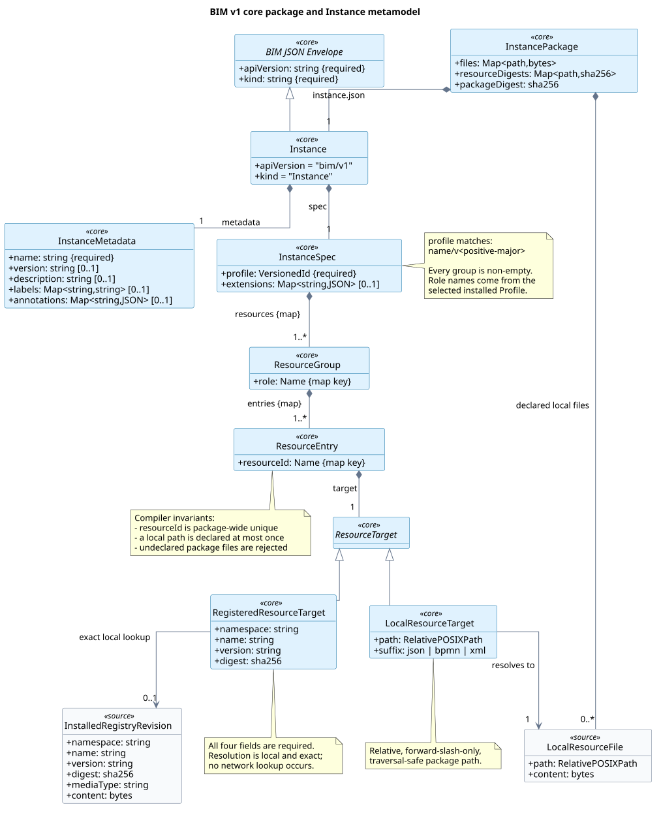
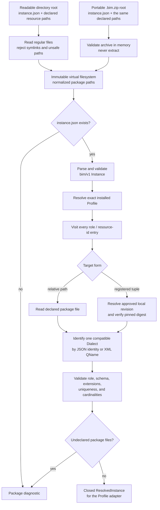

# Level 0 — Foundations

This level isolates the smallest reusable BIM concepts. It describes the
container and package mechanics, not the service-binding vocabulary supplied
by `qos-binding/v1`. The numbered level is a progressive view of BIM v1, not a
different language version.

## From metamodel to execution

**Status:** `normative-derived`

**Sources:** [`instance.schema.json`](../../schemas/bim/v1/instance.schema.json),
the installed framework and compiler boundary in
[`compiler.py`](../../openbinding-gateway/src/openbinding_gateway/v1/compiler.py),
and the IR contract in
[`binding-problem.schema.json`](../../schemas/bim/v1/binding-problem.schema.json).

```mermaid
flowchart LR
  accTitle: BIM's progressive model stack
  accDescr: The core metamodel constrains Profiles; Profiles admit compatible Dialects; Dialects type source resources; an Instance indexes concrete resources; installed adapters lower them to IR consumed by an Engine.

  M["Core metamodel<br/>container and package rules"]
  P["Profile model<br/>roles, cardinalities, output IR"]
  D["Dialect model<br/>resource and extension languages"]
  S["Source model<br/>typed resources"]
  I["Concrete Instance<br/>role-indexed package"]
  C["Installed compiler<br/>schemas and adapters"]
  R["Canonical IR<br/>Profile-declared output"]
  E["Compatible Engine<br/>selected from IR features"]

  M -->|"constrains"| P
  P -->|"admits compatible"| D
  D -->|"defines"| S
  S -->|"is indexed by"| I
  I --> C
  P -.->|"pins Profile adapter"| C
  D -.->|"pins Dialect adapters"| C
  C -->|"validates and lowers"| R
  R --> E
```

The arrows express conformance and transformation, not a runtime inheritance
chain. A **Profile** defines one problem family's roles and result contract. A
compatible **Dialect** supplies concrete whole-resource types or inline
extension points. A source **model** conforms to those contracts; an
**Instance** is the concrete package index plus the resources it identifies.
Only installed, digest-pinned schemas and adapters can turn that source into
IR for an Engine.

## Minimal core metamodel

**Status:** `normative-derived`

**Sources:** [`instance.schema.json`](../../schemas/bim/v1/instance.schema.json),
package loading in
[`package.py`](../../openbinding-gateway/src/openbinding_gateway/v1/package.py),
and resource indexing in
[`compiler.py`](../../openbinding-gateway/src/openbinding_gateway/v1/compiler.py).

The diagram's formal source is
[`plantuml/00-core-metamodel.puml`](plantuml/00-core-metamodel.puml).

The core contract has four consequences:

- A BIM JSON control resource has a closed `apiVersion` / `kind` / `metadata`
  / `spec` envelope. For `Instance`, the fixed identity is `bim/v1`
  `Instance`, and `metadata.name` is required.
- `spec.profile` selects an installed versioned Profile. The names below
  `spec.resources` are interpreted as Profile roles; they are not embedded in
  the core schema.
- Each role group is non-empty and maps a package-wide resource id to exactly
  one target: a safe relative local path or an immutable registered reference.
  The compiler additionally rejects duplicate ids across role groups and
  duplicate local paths.
- A registered reference is the tuple `namespace`, `name`, `version`, and
  `digest`. It must resolve to an already approved local registry revision at
  that exact digest; compilation never turns it into a network lookup.

The target in `instance.json` should not be confused with a logical reference
inside a Profile resource. In the executable QoS-binding source languages, a
logical reference has the explicit shape `{"resource":"...","id":"..."}`:
`resource` names the package-wide resource id, while `id` names an element
inside that resource. That convention belongs to the Profile's source model,
not to the reusable `Instance` metamodel.

## Directory and portable package resolution

**Status:** `normative-derived`

**Sources:** secure virtual-filesystem construction in
[`package.py`](../../openbinding-gateway/src/openbinding_gateway/v1/package.py),
the [`Instance` schema](../../schemas/bim/v1/instance.schema.json), and
container resolution in
[`compiler.py`](../../openbinding-gateway/src/openbinding_gateway/v1/compiler.py).

Both input forms therefore have the same logical meaning. The directory is
the author-friendly representation. `InstancePackage.to_zip()` creates the
portable representation deterministically by canonicalizing JSON, normalizing
XML line endings, sorting paths, fixing ZIP metadata, and storing entries
without extraction. Per-entry, total-size, entry-count, compression-ratio,
path-depth, duplicate-name, encryption, and symlink checks protect the package
boundary.

`instance.json` is the complete index. Local files not declared by that index
are rejected, and a declared resource that cannot be read, typed by exactly
one compatible Dialect, placed in its permitted role, or validated against its
pinned schema prevents construction of the resolved context. The next level
explains how Profiles and Dialects define those checks.
