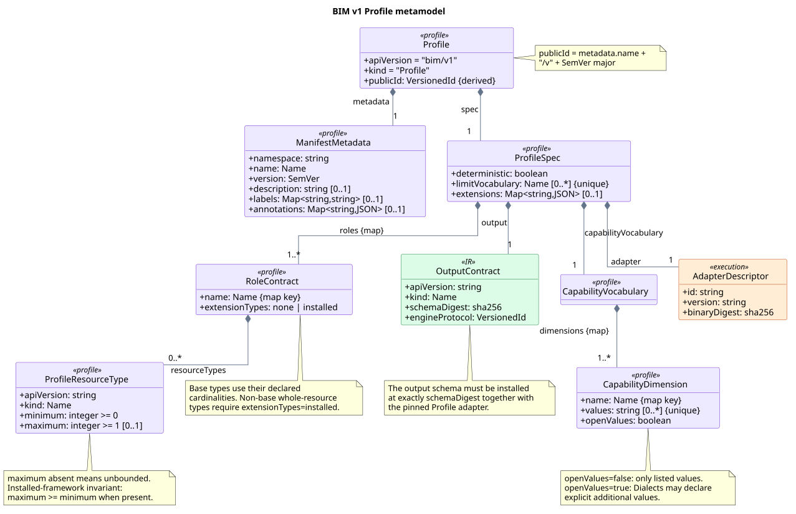
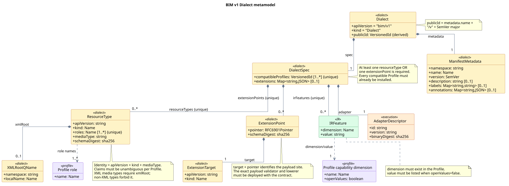
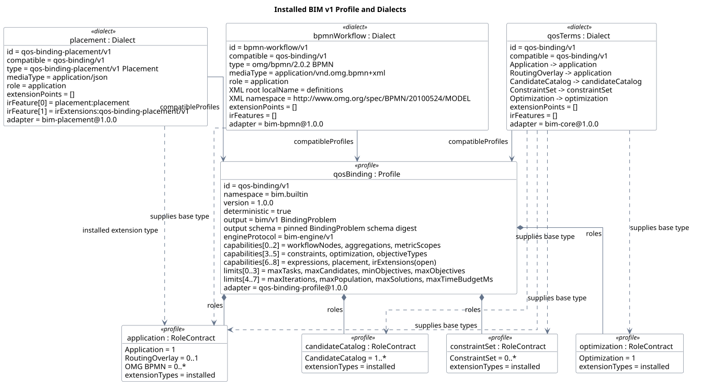
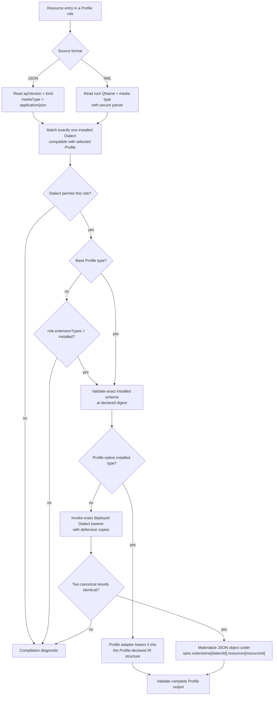
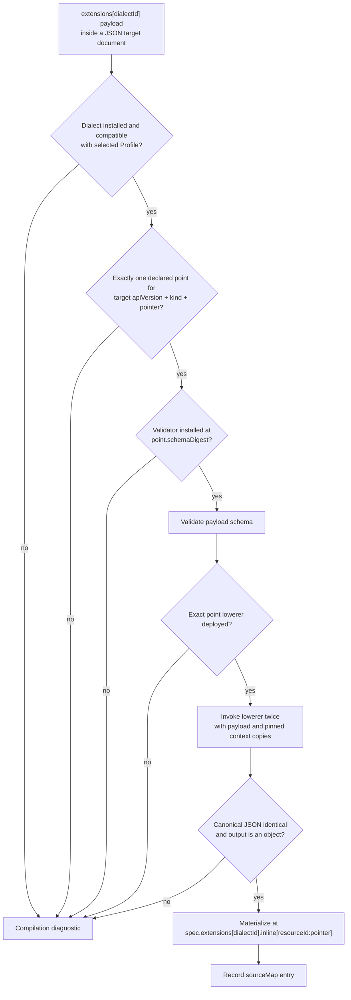
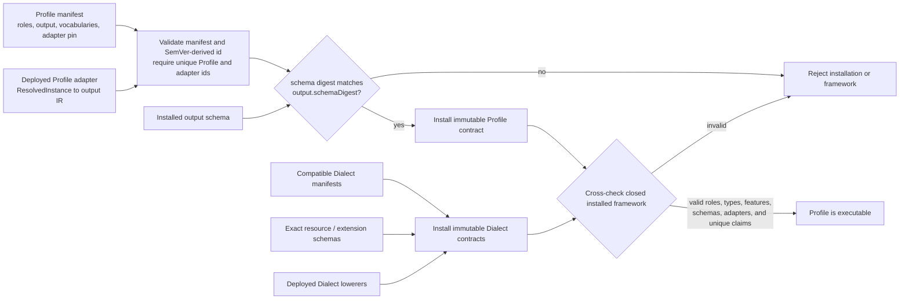
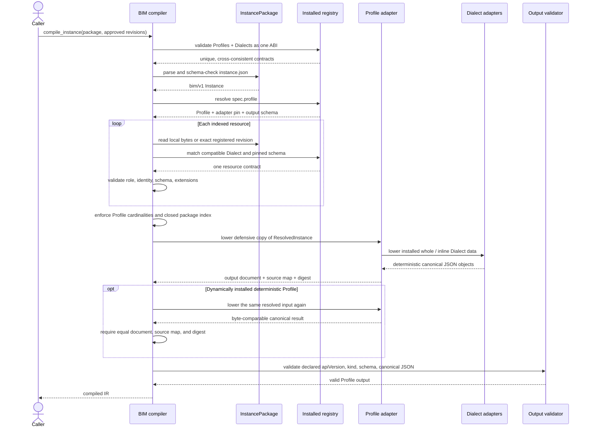

# Level 1 — Profiles and Dialects

Profiles and Dialects are immutable, installed contracts around the small BIM
container. A Profile supplies the semantic frame for a problem family. A
Dialect supplies a concrete source language that can participate in that
frame. Neither manifest carries executable code, schema downloads, or
installer URLs: the host must already have every pinned validator, adapter,
and output schema.

## Profile metamodel

**Status:** `normative-derived`

**Sources:** [`profile.schema.json`](../../schemas/bim/v1/profile.schema.json),
the built-in Profile manifest, `install_profile_contract`, and framework
cross-checks in
[`compiler.py`](../../openbinding-gateway/src/openbinding_gateway/v1/compiler.py).

The diagram's formal source is
[`plantuml/01-profile-metamodel.puml`](plantuml/01-profile-metamodel.puml).

A Profile's public id is derived, not stored: `metadata.name` plus the major
component of `metadata.version` gives `name/v<major>`. Its specification owns:

- one or more named roles, each with base resource identities and independent
  minimum/optional maximum cardinalities;
- `extensionTypes: none|installed`, which determines whether a role can admit
  whole-resource types that are not among its base rules;
- the exact output `apiVersion`, `kind`, schema digest, and Engine protocol;
- named capability dimensions with closed or open value vocabularies;
- the names of limits understood by that Profile; and
- a deployed adapter ABI pinned by id, version, and binary digest.

The schema permits an empty `resourceTypes` list within a role and an empty
value list within a capability dimension. The installed-framework checks add
cross-manifest invariants: maximum cardinality cannot be below minimum, the
output schema must exist at its exact digest, and each required base resource
identity must be supplied by a compatible installed Dialect.

## Dialect metamodel

**Status:** `normative-derived`

**Sources:** [`dialect.schema.json`](../../schemas/bim/v1/dialect.schema.json),
Dialect installation, framework validation, resource matching, and extension
lowering in
[`compiler.py`](../../openbinding-gateway/src/openbinding_gateway/v1/compiler.py).

The diagram's formal source is
[`plantuml/01-dialect-metamodel.puml`](plantuml/01-dialect-metamodel.puml).

A Dialect is compatible with at least one versioned Profile and must declare at
least one whole `resourceType` or one inline `extensionPoint`. A whole resource
is identified by the full tuple `apiVersion`, `kind`, and `mediaType`; XML also
requires an exact root QName. Its declared role names must exist in every
compatible Profile. An extension point identifies one target resource type,
one RFC 6901 JSON Pointer, and one payload schema digest.

Every `irFeature` is a `{dimension,value}` pair in the compatible Profile's
capability vocabulary. Closed dimensions reject unknown values; open
dimensions allow a Dialect to introduce explicit values. For the executable
QoS-binding Profile, a generic installed whole-resource Dialect must advertise
`irExtensions=<dialect-id>` so Engines cannot accidentally accept lowered
extension data they do not understand.

## Installed BIM v1 framework

**Status:** `informative` snapshot of installed manifests

**Sources:** `installed_profile_manifests()` and
`installed_dialect_manifests()` in
[`compiler.py`](../../openbinding-gateway/src/openbinding_gateway/v1/compiler.py),
the source schemas under [`schemas/bim/v1`](../../schemas/bim/v1/), and the
vendored [OMG BPMN 2.0.2 schema bundle](../../openbinding-gateway/src/openbinding_gateway/v1/vendor/omg/bpmn/2.0.2/).

The diagram's formal source is
[`plantuml/01-installed-framework.puml`](plantuml/01-installed-framework.puml).

The current built-in registry contains one executable Profile and three
compatible Dialects:

| Installed contract | Complete source types | Declared IR features |
| --- | --- | --- |
| Profile `qos-binding/v1` | Base role rules shown in the object diagram | Output `bim/v1` `BindingProblem` under `bim-engine/v1` |
| Dialect `qos-binding/v1` | `Application`, `CandidateCatalog`, `ConstraintSet`, `Optimization`, `RoutingOverlay` | None beyond features extracted from the native IR |
| Dialect `bpmn-workflow/v1` | OMG `BPMN` 2.0.2 XML rooted at `{http://www.omg.org/spec/BPMN/20100524/MODEL}definitions` | None beyond the canonical workflow features |
| Dialect `qos-binding-placement/v1` | `Placement` in the `application` role | `placement=placement`; `irExtensions=qos-binding-placement/v1` |

All four Profile roles currently use `extensionTypes: installed`. Placement is
therefore accepted as an installed additional whole-resource type in the
`application` role; it does not modify `Instance` and is not another Profile.
The bundled Dialects currently have no inline extension points, although the
framework supports them for installed domain Dialects.

## Whole-resource Dialect path

**Status:** `normative-derived`

**Sources:** resource matching in `_resource_index`, contract installation in
`install_dialect_contract`, and generic lowering in
`_lower_installed_dialect_resources` in
[`compiler.py`](../../openbinding-gateway/src/openbinding_gateway/v1/compiler.py).

The explicit `spec.extensions` branch is the generic path for additionally
installed JSON resource Dialects. The bundled QoS, BPMN, and Placement
adapters are integrated into the bundled Profile implementation and populate
its declared IR sections, but are governed by the same installed-manifest,
identity, role, schema, and digest boundary. A package can select a deployed
language; it cannot provide or download its implementation.

## Inline-extension Dialect path

**Status:** `normative-derived`

**Sources:** `_check_extensions`, `_lower_inline_extensions`,
`install_extension_validator`, and `install_dialect_contract` in
[`compiler.py`](../../openbinding-gateway/src/openbinding_gateway/v1/compiler.py),
plus [`dialect.schema.json`](../../schemas/bim/v1/dialect.schema.json).

Validation alone never assigns semantics. The source payload is not copied
through as guessed IR, and duplicate outputs at the same
`resourceId:pointer` are rejected. Editors may preserve an unknown payload for
round-trip purposes, but the compiler stops until its exact contract is
installed.

## Installing a new Profile

**Status:** `normative-derived`

**Sources:** `install_profile_contract`, `install_dialect_contract`, and
`installed_framework_diagnostics` in
[`compiler.py`](../../openbinding-gateway/src/openbinding_gateway/v1/compiler.py),
[`profile.schema.json`](../../schemas/bim/v1/profile.schema.json), and
[`dialect.schema.json`](../../schemas/bim/v1/dialect.schema.json).

The Profile adapter receives a closed, Profile-neutral `ResolvedInstance`; it
does not re-read unchecked package files or redefine core resolution. It must
return the Profile's declared output identity and a separate source map. The
host validates the output schema and canonical JSON before exposing the IR.
Installing the Profile does not by itself make undeployed resource languages
available: compatible Dialect contracts complete the framework.
The generic Dialect installation API accepts JSON resource types; an XML
Dialect additionally requires a dedicated installed parser/lowering adapter.

## Resolution, validation, and deterministic lowering

**Status:** `normative-derived`

**Sources:** `compile_instance`, `_resolve_instance`, installed-adapter
lowering, and `_validated_profile_output` in
[`compiler.py`](../../openbinding-gateway/src/openbinding_gateway/v1/compiler.py),
package access in
[`package.py`](../../openbinding-gateway/src/openbinding_gateway/v1/package.py),
and the [`BindingProblem` schema](../../schemas/bim/v1/binding-problem.schema.json).

The bundled `qos-binding/v1` adapter is covered by its corpus and round-trip
conformance gate rather than being executed twice for every production
request. Dynamically installed deterministic Profile adapters are compared on
each invocation. Generic installed QoS-compatible Dialect lowerers are always
called twice at their integration boundary. Any ambiguity, missing pin,
schema error, non-object result, non-canonical value, or differing repeated
result is a compilation failure rather than a fallback interpretation.
