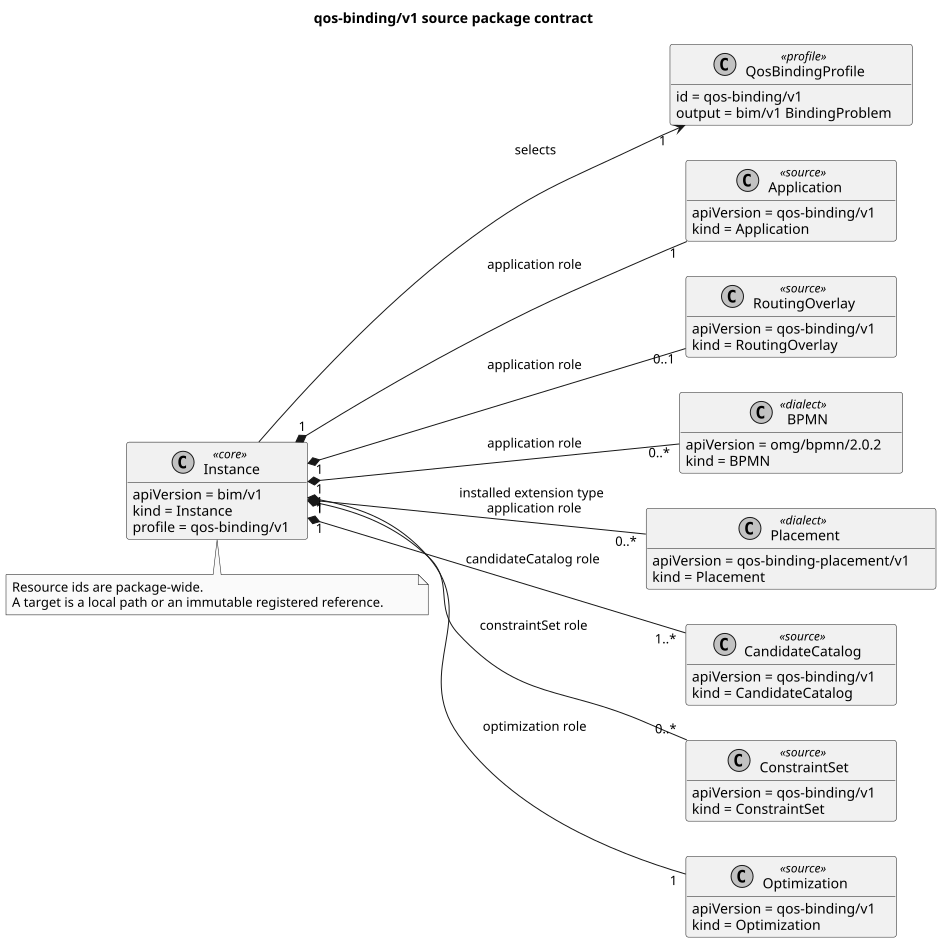
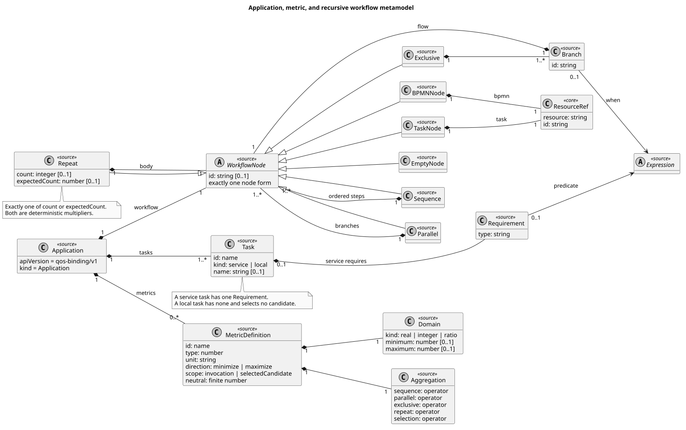
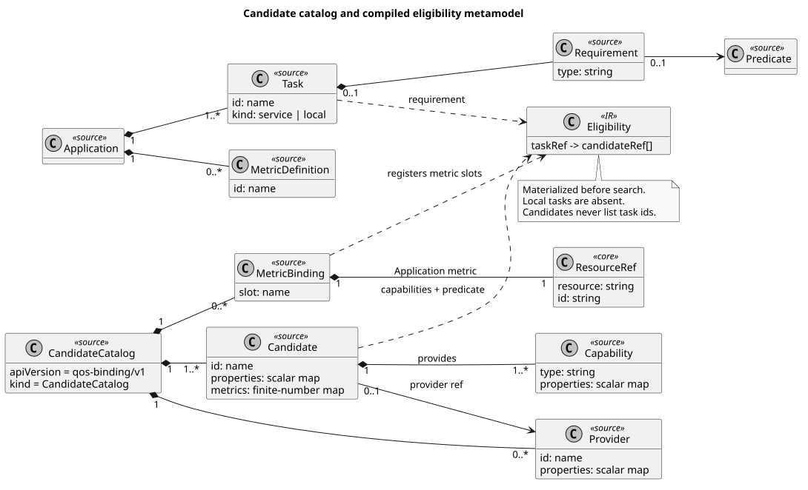
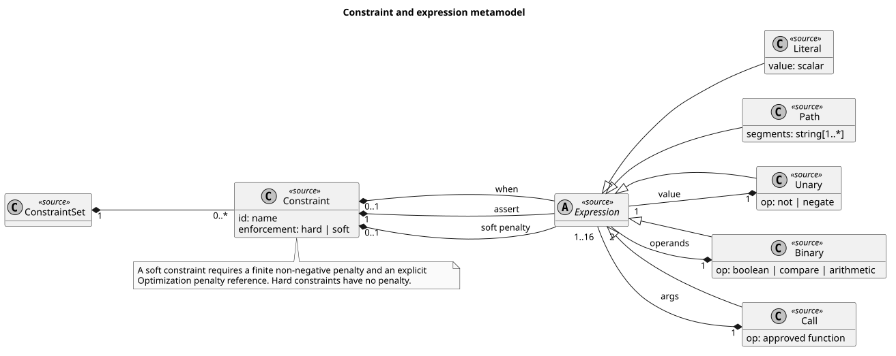
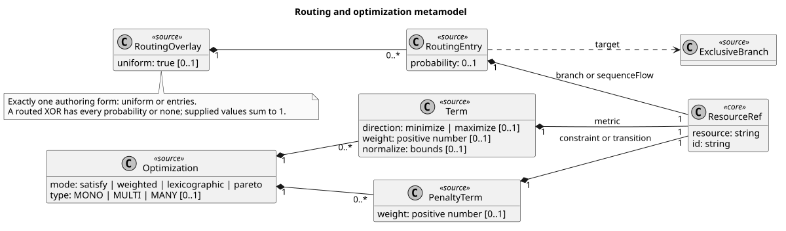
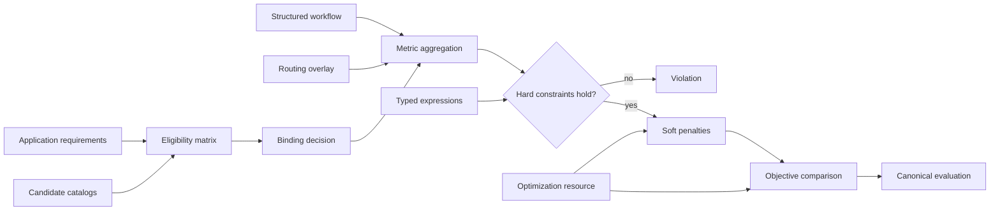

# Level 2 — the QoS-binding Profile

Status: **normative-derived**. This chapter projects the installed
`qos-binding/v1` Profile, its source schemas, and the compiler's canonical
lowering. It does not make the four QoS roles part of the generic BIM core.

## Profile-directed package

PlantUML source: [`02-qos-package.puml`](plantuml/02-qos-package.puml).
Primary sources: [`profile.schema.json`](../../schemas/bim/v1/profile.schema.json),
the installed manifest in
[`compiler.py`](../../openbinding-gateway/src/openbinding_gateway/v1/compiler.py),
and the source schemas under [`schemas/bim/v1`](../../schemas/bim/v1/).

The selected Profile requires exactly one Application, one or more candidate
catalogs, zero or more constraint sets, and exactly one Optimization. A
RoutingOverlay is optional and singular. BPMN and Placement occupy the
`application` role under installed Dialect contracts; multiple BPMN or
Placement resources are permitted when their references remain unambiguous.

## Application and workflow

PlantUML source:
[`02-application-workflow.puml`](plantuml/02-application-workflow.puml).
Primary source:
[`application.schema.json`](../../schemas/bim/v1/application.schema.json).

Every Application owns at least one task, zero or more metric definitions, and
one workflow root. The source workflow is a recursive tagged union: `task`,
`empty`, `sequence`, `parallel`, `exclusive`, `repeat`, or `bpmn`. A service
task requires one capability type, optionally refined by a typed predicate; a
local task requires no candidate. Each metric declares deterministic scalar
semantics and aggregation for sequence, parallel, exclusive, repeat, and
selected-candidate composition.

## Candidate catalogs and eligibility

PlantUML source:
[`02-catalog-eligibility.puml`](plantuml/02-catalog-eligibility.puml).
Primary sources:
[`candidate-catalog.schema.json`](../../schemas/bim/v1/candidate-catalog.schema.json)
and candidate normalization in
[`compiler.py`](../../openbinding-gateway/src/openbinding_gateway/v1/compiler.py).

Catalog candidates publish capability types, optional stable scalar
properties, providers, and metric slots. They never contain task ids.
Application requirements and predicates are evaluated before search to produce
the closed `eligibility` matrix in the BindingProblem IR. Each catalog metric
slot is connected to an Application metric through an explicit resource
reference.

## Constraints and expressions

PlantUML source:
[`02-constraints-expressions.puml`](plantuml/02-constraints-expressions.puml).
Primary sources:
[`constraint-set.schema.json`](../../schemas/bim/v1/constraint-set.schema.json),
and [`expressions.py`](../../openbinding-gateway/src/openbinding_gateway/v1/expressions.py).

Constraints use either the compact JSON AST or the restricted CEL form; both
lower to the same typed Expression IR. `when` short-circuits the assertion.
Every soft violation has a finite non-negative penalty and must be activated
by an Optimization penalty reference.

## Routing and optimization

PlantUML source:
[`02-optimization-routing.puml`](plantuml/02-optimization-routing.puml).
Primary sources:
[`optimization.schema.json`](../../schemas/bim/v1/optimization.schema.json) and
[`routing-overlay.schema.json`](../../schemas/bim/v1/routing-overlay.schema.json).

Optimization supports `satisfy`, weighted, lexicographic, and Pareto
comparison. Routing data remains separate from the workflow notation and
targets native branch ids or BPMN sequence-flow ids.

## Executable semantic flow

The gateway executes this same model after an Engine responds. A candidate
value is never imputed, an unsupported expression is never delegated as raw
source, and an Engine result that cannot be reproduced by the canonical
evaluator is rejected. The precise mathematical rules remain in
[SEMANTICS](../SEMANTICS.md), [METRICS](../METRICS.md), and
[EXPRESSIONS](../EXPRESSIONS.md).
