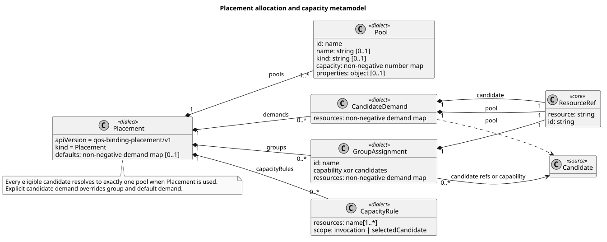
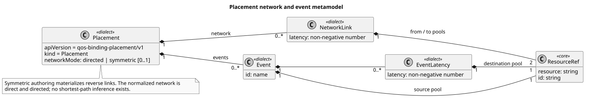
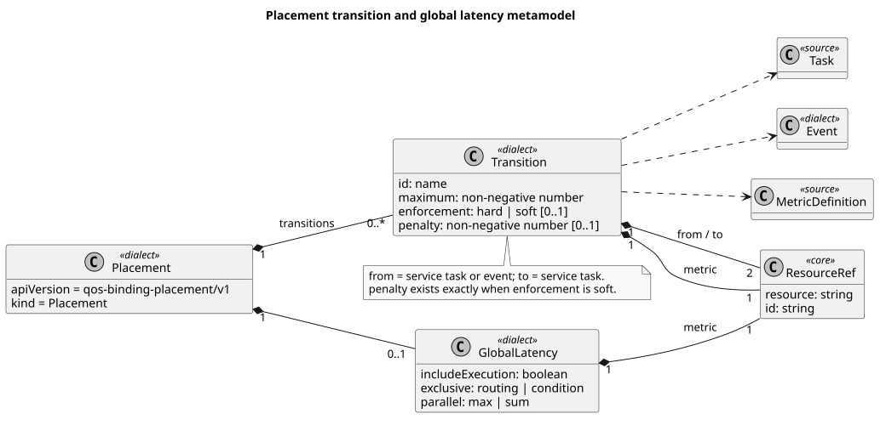
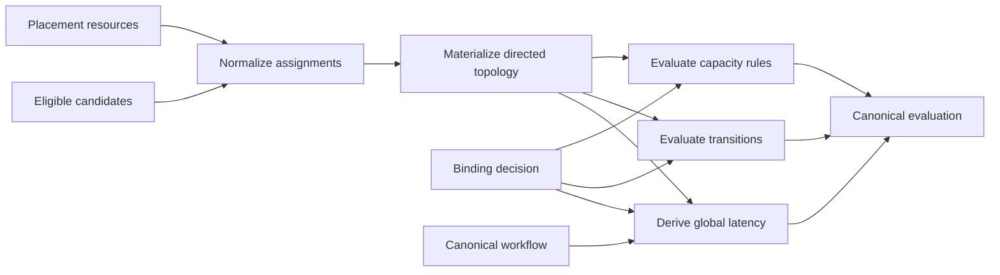
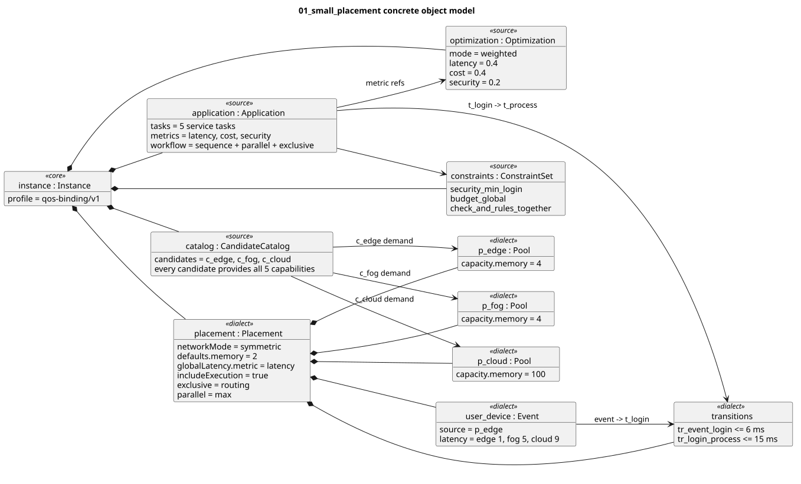
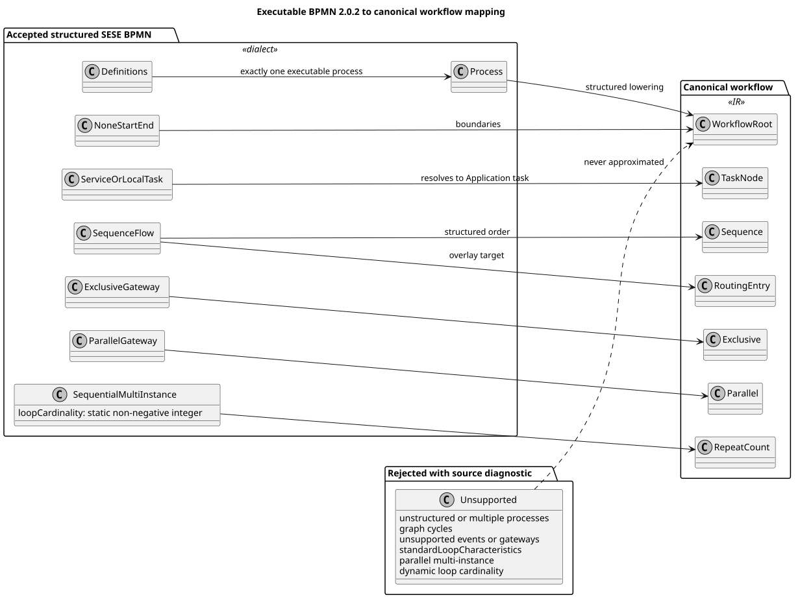
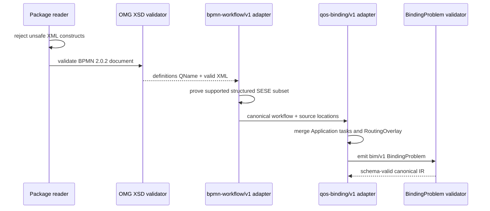

# Level 3 — Placement and BPMN Dialects

Placement and BPMN are independently identified source languages compatible
with the `qos-binding/v1` Profile. Their schemas and adapters are installed by
the host; putting either syntax in a package cannot install executable code.

## Placement metamodel

Status: **normative-derived**.

The complete Placement metamodel is shown as three non-overlapping facets so
cardinalities remain readable at normal and narrow documentation widths.

PlantUML source:
[`03-placement-allocation.puml`](plantuml/03-placement-allocation.puml).
Primary sources:
[`placement.schema.json`](../../schemas/bim/v1/placement.schema.json),
[`PLACEMENT.md`](../PLACEMENT.md), and Placement lowering in
[`compiler.py`](../../openbinding-gateway/src/openbinding_gateway/v1/compiler.py).

PlantUML source:
[`03-placement-network.puml`](plantuml/03-placement-network.puml).

PlantUML source:
[`03-placement-latency.puml`](plantuml/03-placement-latency.puml).

A Placement resource contributes pools and candidate-to-pool assignments.
Defaults, group assignments, and explicit demands normalize to one assignment
per eligible candidate. Capacity rules state both the constrained dimensions
and whether demand is charged per deterministic invocation or once per
distinct selected candidate.

The network is direct and directed after normalization. `symmetric` authoring
materializes equal reverse links; it does not enable shortest paths. Events are
fixed external sources. Transitions constrain task-to-task or event-to-task
transfer, while `globalLatency` can replace one Application metric with the
structured workflow's transfer-aware latency.

## Concrete Placement instance

Status: **informative**.

PlantUML source:
[`03-small-placement.puml`](plantuml/03-small-placement.puml). Source package:
[`examples/placement/01_small_placement`](../../examples/placement/01_small_placement/).

The instance has five service tasks, three universally capable candidates, and
edge, fog, and cloud pools. Candidate demands fix each candidate to its matching
pool. Symmetric direct latency, a user-device event, two transition bounds, a
selected-candidate memory rule, and transfer-aware global latency constrain the
same binding optimized for latency, cost, and security.

## BPMN mapping

Status: **normative-derived**.

PlantUML source: [`03-bpmn-mapping.puml`](plantuml/03-bpmn-mapping.puml).
Primary sources: [`BPMN.md`](../BPMN.md), the vendored OMG BPMN 2.0.2 XSD
bundle, and `_bpmn_workflow` in
[`compiler.py`](../../openbinding-gateway/src/openbinding_gateway/v1/compiler.py).

BIM preserves normative BPMN XML but executes only one structured SESE process
using resolvable service/local tasks, none start/end events, sequence flow,
structured XOR/AND gateways, and static sequential multi-instance activities.
Every other construct produces an element-local diagnostic instead of an
approximation. Probabilities remain in a separate RoutingOverlay whose targets
are BPMN `sequenceFlow` ids.

The native JSON twin and its BPMN representation are compared as concrete
instances in [level 5](05-instances-and-catalog.md).
