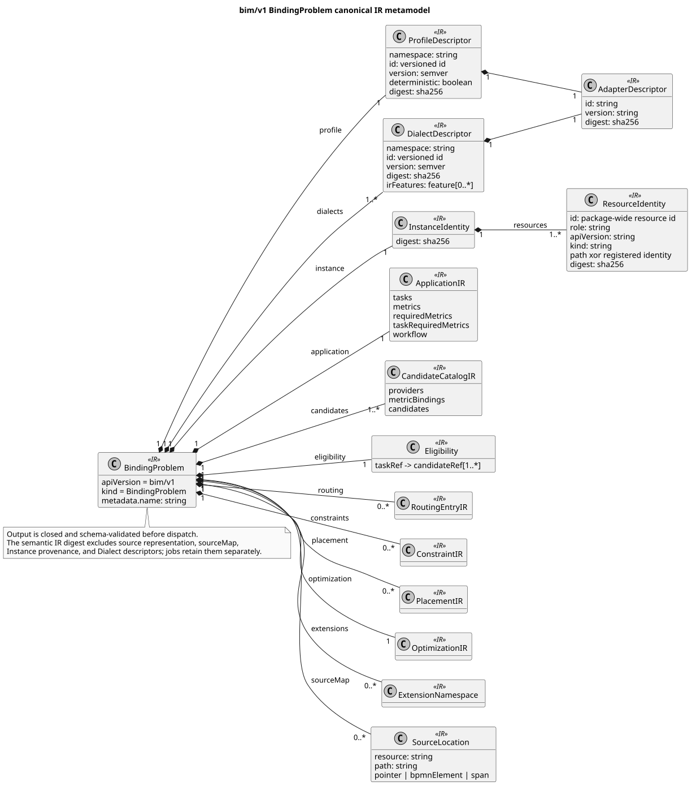
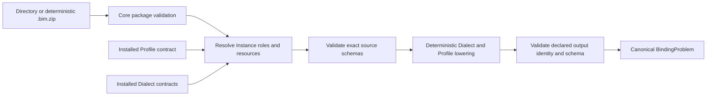
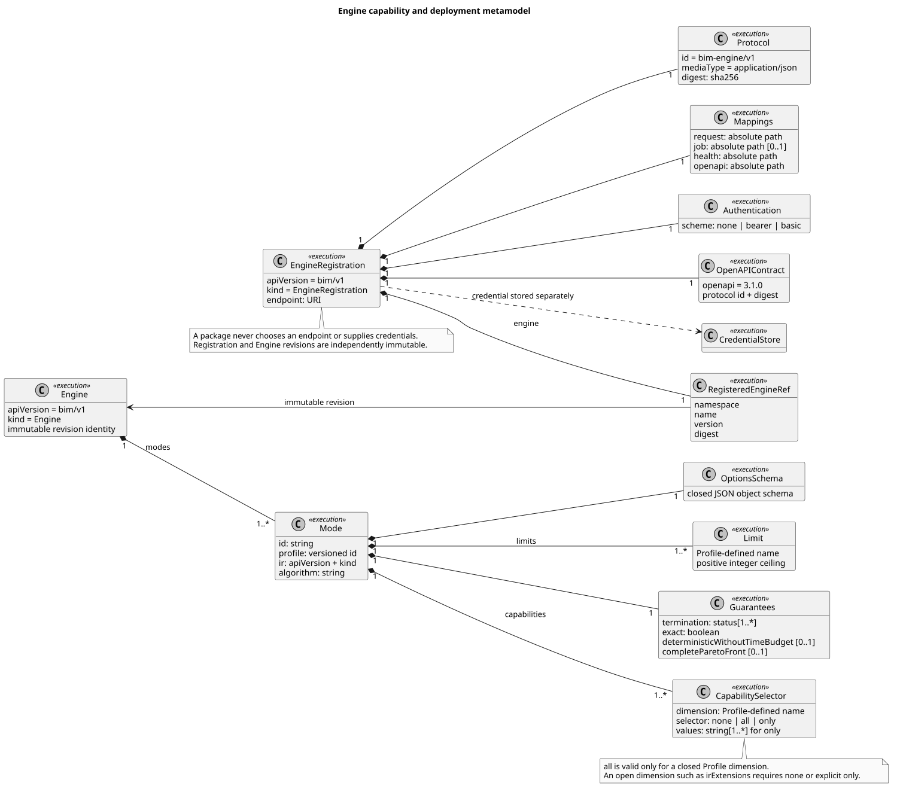
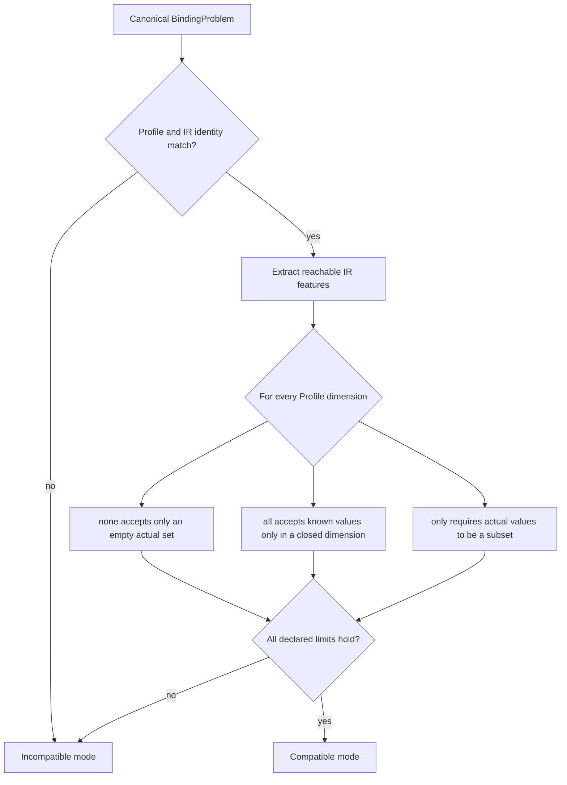
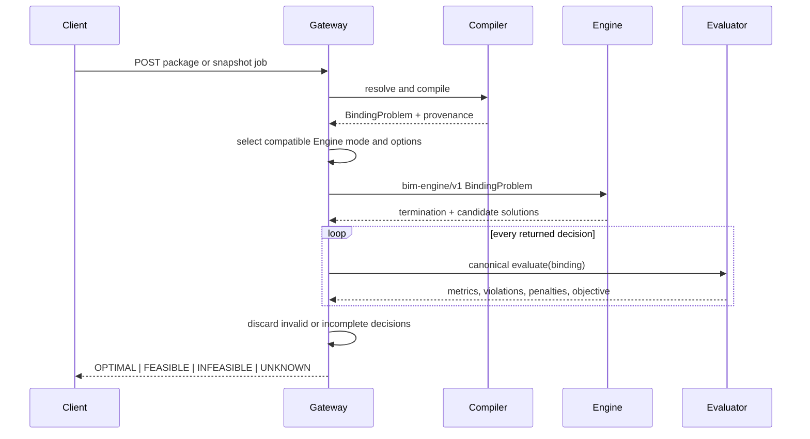
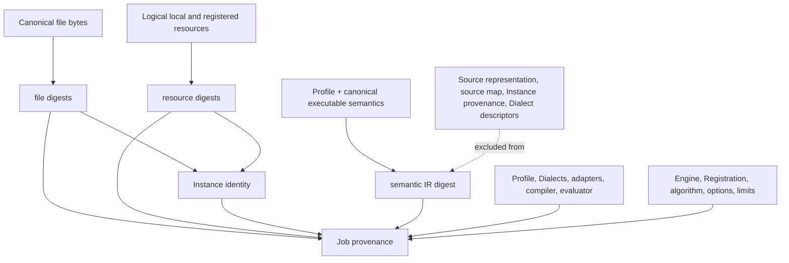

# Level 4 — canonical IR and execution

This level is the boundary between source-language extensibility and decision
search. Engines receive only the Profile-declared output IR. They do not parse
packages, fetch schemas, select Dialects, or assign meaning to source
extensions.

## BindingProblem IR

Status: **normative-derived**.

PlantUML source:
[`04-binding-problem-ir.puml`](plantuml/04-binding-problem-ir.puml). Primary
source:
[`binding-problem.schema.json`](../../schemas/bim/v1/binding-problem.schema.json).

The `qos-binding/v1` Profile emits one closed `bim/v1` `BindingProblem`. It
pins the Profile and selected Dialect adapters, retains Instance and resource
identity, materializes defaults and eligibility, and contains the canonical
application, routing, policy, Placement, optimization, extension output, and
source map. Output identity and schema are declared by the Profile and checked
after lowering.

## Engine and Registration contracts

Status: **normative-derived**.

PlantUML source:
[`04-engine-metamodel.puml`](plantuml/04-engine-metamodel.puml). Primary
sources: [`engine.schema.json`](../../schemas/bim/v1/engine.schema.json),
[`engine-registration.schema.json`](../../schemas/bim/v1/engine-registration.schema.json),
and compatibility logic in
[`routes/v1.py`](../../openbinding-gateway/src/openbinding_gateway/routes/v1.py).

An Engine is an immutable public declaration with one or more modes. Each mode
targets an exact Profile and IR identity, selects supported values for every
Profile capability dimension, validates closed options, declares Profile-known
limits, and states only guarantees the concrete algorithm can establish.
Deployment is separate: EngineRegistration pins an Engine revision, protocol
and OpenAPI digests, same-origin paths, endpoint, and authentication scheme.
Credentials are stored separately and never serialized in a manifest.

## Compatibility

The open `irExtensions` dimension can never use `all`; a mode must select
`none` or explicitly name every extension namespace it evaluates. Placement
therefore requires both the closed `placement=placement` feature and
`irExtensions=qos-binding-placement/v1`.

## Job, solve, and authoritative evaluation

An algorithm family never implies a termination status. The result reports the
evidence produced by that run, and all retained decisions must agree with the
gateway evaluator.

## Digests and provenance

Representation independence allows equivalent BPMN and native JSON to share a
semantic problem identity without discarding their different source locations
or installed-Dialect evidence. See [ENGINE_INTEGRATION](../ENGINE_INTEGRATION.md)
for the wire contract and lifecycle details.
