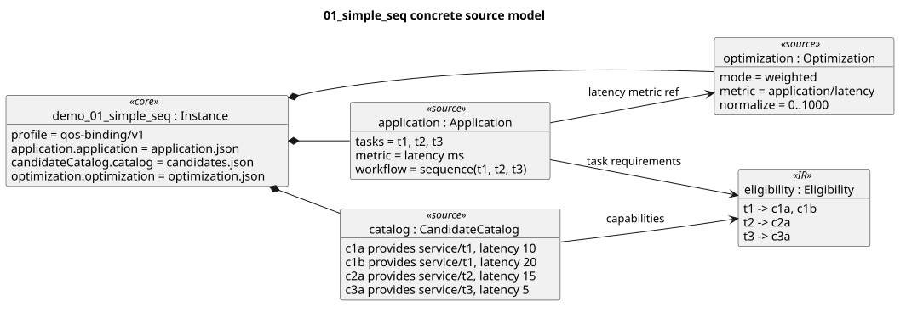
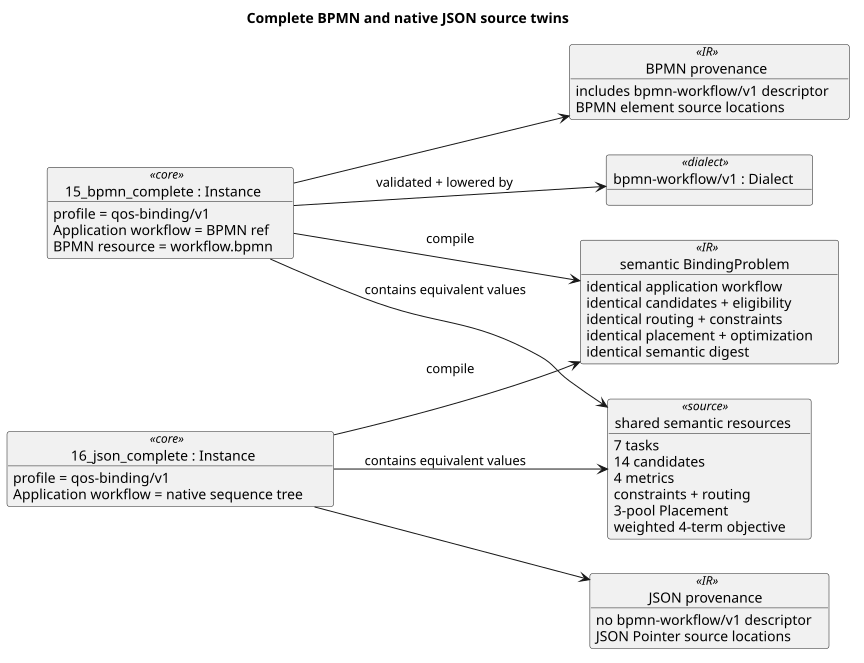
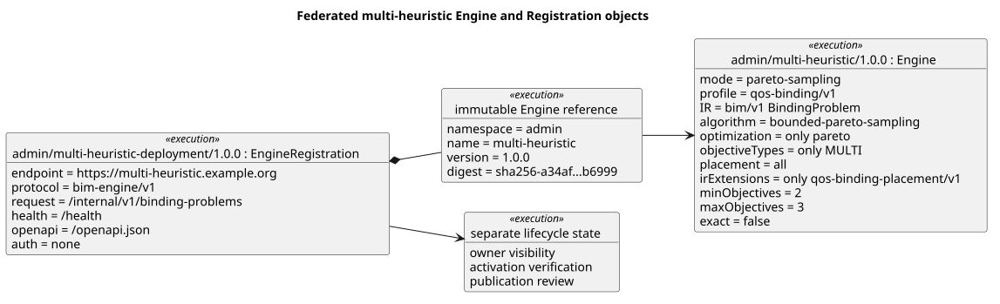

# Level 5 — concrete instances and corpus catalog

The formal metamodels become useful only when they explain real objects. This
chapter diagrams a minimal source package, a Placement package, equivalent
BPMN/JSON representations, and a federated Engine deployment. It then accounts
for every checked-in source package family without repeating equivalent object
graphs.

## Minimal QoS-binding instance

Status: **informative**.

PlantUML source:
[`05-simple-sequence.puml`](plantuml/05-simple-sequence.puml). Source package:
[`examples/demo/01_simple_seq`](../../examples/demo/01_simple_seq/).

Three service tasks form a sequence. Four candidates create two alternatives
only for `t1`; the compiler materializes that relationship as eligibility.
One latency metric and one normalized weighted term are sufficient to make the
package executable. The Placement object instance is documented separately in
[level 3](03-dialect-details.md#concrete-placement-instance).

## Equivalent complete representations

Status: **informative**, enforced by regression tests.

PlantUML source:
[`05-bpmn-json-twins.puml`](plantuml/05-bpmn-json-twins.puml). Source packages:
[`15_bpmn_complete`](../../examples/demo/15_bpmn_complete/) and
[`16_json_complete`](../../examples/demo/16_json_complete/).

Both packages describe seven tasks, fourteen candidates, four metrics,
constraints, routing, three-pool Placement, and the same four-term weighted
objective. Their canonical executable fields and semantic digest are equal for
all 128 possible bindings. Their provenance differs: only the XML package pins
`bpmn-workflow/v1` and BPMN element locations.

## Federated execution objects

Status: **informative**.

PlantUML source:
[`05-federated-engine.puml`](plantuml/05-federated-engine.puml). Source objects:
[`engine.json`](../../examples/federation/multi-heuristic/engine.json) and
[`registration.json`](../../examples/federation/multi-heuristic/registration.json).

The Engine declares bounded Pareto sampling for two or three objectives. The
separate Registration pins that exact revision and the `bim-engine/v1` HTTP
contract. Runtime ownership, activation, credential storage, and publication
state do not alter either source metamodel.

## Language and installed-component coverage

| Layer | Concrete kinds or instances | Count |
| --- | --- | ---: |
| BIM source/control | `Instance`, `Profile`, `Dialect`, `Engine`, `EngineRegistration` | 5 kinds |
| QoS-binding source | `Application`, `CandidateCatalog`, `ConstraintSet`, `Optimization`, `RoutingOverlay` | 5 kinds |
| Installed domain source | Placement JSON and OMG BPMN 2.0.2 XML | 2 kinds |
| Current output IR | `BindingProblem` | 1 kind |
| Executable Profiles | `qos-binding/v1` | 1 |
| Installed Dialects | `qos-binding/v1`, `bpmn-workflow/v1`, `qos-binding-placement/v1` | 3 |
| Bundled Engines | random-search, many-heuristic, evolutionary-heuristics, minizinc-csp | 4 |
| Bundled modes | seeded, pareto-sampling, elitist-genetic, pareto-genetic, exact-weighted | 5 |
| Federated example | multi-heuristic / pareto-sampling | 1 |

### Installed Profile and Dialect matrix

| Contract | Kind | Entry surface | Corpus evidence |
| --- | --- | --- | --- |
| `qos-binding/v1` | Profile | Roles and cardinalities for the complete binding problem | All 79 source packages |
| `qos-binding/v1` | Dialect | Whole JSON resources for the five QoS-binding kinds | All 79 source packages |
| `bpmn-workflow/v1` | Dialect | Whole BPMN 2.0.2 XML Application resource | `15_bpmn_complete` |
| `qos-binding-placement/v1` | Dialect | Whole Placement JSON Application resource | Four Placement packages and both complete twins |

### Bundled Engine and mode matrix

| Engine | Mode | Profile | IR extension selector |
| --- | --- | --- | --- |
| `random-search` | `seeded` | `qos-binding/v1` | `only: qos-binding-placement/v1` |
| `many-heuristic` | `pareto-sampling` | `qos-binding/v1` | `only: qos-binding-placement/v1` |
| `evolutionary-heuristics` | `elitist-genetic` | `qos-binding/v1` | `only: qos-binding-placement/v1` |
| `evolutionary-heuristics` | `pareto-genetic` | `qos-binding/v1` | `only: qos-binding-placement/v1` |
| `minizinc-csp` | `exact-weighted` | `qos-binding/v1` | `only: qos-binding-placement/v1` |

These five rows are derived from the four checked-in Engine manifests under
[`schemas/bim/v1/manifests`](../../schemas/bim/v1/manifests/). They describe
compatibility, not deployment availability.

## Demo catalog — 17 packages

| Package | Primary coverage |
| --- | --- |
| `01_simple_seq` | Minimal sequence, eligibility, weighted scalar objective |
| `02_parallel` | Parallel workflow and `max` latency aggregation |
| `03_xor_choice` | Probabilistic exclusive branch and RoutingOverlay |
| `04_conflict` | Hard constraint infeasibility |
| `05_multi_obj` | Two normalized terms with explicit `MONO` classification |
| `05_single_obj_various` | The same weighted scalarization with inferred objective type |
| `06_loops` | Deterministic `repeat.expectedCount` aggregation |
| `07_soft_constraints` | Soft assertion and explicitly activated penalty |
| `08_dependencies` | Typed provider properties and cross-task constraint |
| `09_mixed` | Sequence, routed XOR, hard metric constraint |
| `10_large_scale` | Ten tasks; sequence, parallel, exclusive, repeat; four metrics |
| `11_multi_obj_negative` | Two-objective Pareto `MULTI` compatibility |
| `12_many_obj_pareto` | Three-objective Pareto `MANY` compatibility |
| `13_fms` | Fleet-management composition and routing |
| `14_shared_candidates` | Multi-capability candidates and selected-candidate scope |
| `15_bpmn_complete` | Complete supported BPMN, constraints, routing, Placement |
| `16_json_complete` | Native JSON semantic twin of package 15 |

### Feature matrix

| Representative package | Seq. | Parallel | XOR | Repeat | Hard | Soft | Weighted | Pareto | Placement | BPMN |
| --- | :---: | :---: | :---: | :---: | :---: | :---: | :---: | :---: | :---: | :---: |
| `01_simple_seq` | ✓ |  |  |  |  |  | ✓ |  |  |  |
| `02_parallel` |  | ✓ |  |  |  |  | ✓ |  |  |  |
| `03_xor_choice` |  |  | ✓ |  |  |  | ✓ |  |  |  |
| `06_loops` |  |  |  | ✓ |  |  | ✓ |  |  |  |
| `07_soft_constraints` | ✓ |  |  |  |  | ✓ | ✓ |  |  |  |
| `10_large_scale` | ✓ | ✓ | ✓ | ✓ |  |  | ✓ |  |  |  |
| `11_multi_obj_negative` |  |  |  |  |  |  |  | ✓ |  |  |
| `12_many_obj_pareto` |  |  |  |  |  |  |  | ✓ |  |  |
| `15_bpmn_complete` | ✓ | ✓ | ✓ | ✓ | ✓ |  | ✓ |  | ✓ | ✓ |
| `16_json_complete` | ✓ | ✓ | ✓ | ✓ | ✓ |  | ✓ |  | ✓ |  |

### Optimization-mode matrix

| Optimization mode | Schema and evaluator | Source-corpus coverage | Representative package |
| --- | :---: | :---: | --- |
| `satisfy` | ✓ |  | No dedicated source package |
| `weighted` | ✓ | ✓ | `01_simple_seq` |
| `lexicographic` | ✓ |  | No dedicated source package |
| `pareto` | ✓ | ✓ | `12_many_obj_pareto` |

Blank corpus cells are deliberate coverage gaps, not unsupported language
features. The complete mode vocabulary remains visible here even where the
current 79-package corpus has no dedicated instance.

## Literature catalog — 6 packages

| Package | Scenario |
| --- | --- |
| `benatallah` | SELF-SERV travel solution (CTS and ITAS) |
| `bultan` | Store, bank, and warehouse conversation |
| `cremaschi` | Semantic textbook-access composition |
| `netedu` | Transport-agency composition |
| `pautasso` | RESTful e-commerce composition |
| `zhang` | Context-aware entertainment planner |

These are executable deterministic adaptations. Where a source paper does not
publish numeric QoS observations, the checked-in package explicitly labels its
values as illustrative rather than presenting them as measurements.

## Placement catalog — 4 packages

| Package | Primary coverage |
| --- | --- |
| `01_small_placement` | Compact edge/fog/cloud topology, capacity, events, transitions, global latency |
| `02_stock_market_sample` | Pruned stockOrch experiment with real pricing inputs and larger candidate sets |
| `03_cloud_only` | Cloud-oriented candidate placement over the common structured workflow |
| `04_edge_heavy` | Edge-oriented candidate placement over the common structured workflow |

## ICWS matrix — 48 source packages

Six scenarios are crossed with eight policy/objective variants:

| Scenario axis (6) | Variant axis (8) |
| --- | --- |
| Benatallah travel, Bultan warehouse, Cremaschi textbook access, Netedu transport agency, Pautasso e-commerce, Zhang entertainment planner | `mono_one_hard`, `mono_one_soft`, `mono_utility_hard`, `mono_utility_soft`, `multi_hard`, `multi_soft`, `many_hard`, `many_soft` |

The Cartesian product is `6 × 8 = 48` packages under
[`experimentation/icws/instances`](../../experimentation/icws/instances/).
This matrix exercises one-term and utility scalarization, two-objective and
many-objective comparison, and hard versus explicitly penalized soft policy.

## MiniZinc conformance fixtures — 4 packages

The engine-local corpus contains `simple-sequence`, `xor-choice`, `loops`, and
`placement` under
[`engines/minizinc-csp/tests/fixtures`](../../engines/minizinc-csp/tests/fixtures/).
They verify that the TypeScript encoder and MiniZinc model consume canonical
IR rather than source-specific syntax.

## Source-corpus accounting

| Source family | Packages |
| --- | ---: |
| Demos | 17 |
| Literature | 6 |
| Placement | 4 |
| ICWS matrix | 48 |
| MiniZinc fixtures | 4 |
| **Total compiled source corpus** | **79** |

`tools/check_bim_corpus.py --expected 79` discovers and compiles precisely
these package directories. A count change is a documentation change as well as
a corpus change.

## Derived ICSOC instances — 105 artifacts

[`experimentation/icsoc/out/bim-v1`](../../experimentation/icsoc/out/bim-v1/)
contains generated outputs rather than additional source-corpus cases. The
three applications `arOrch`, `mediaOrch`, and `stockOrch` each have 35
infrastructure sizes from 50 through 220 in steps of five: `3 × 35 = 105`.
They are summarized as one generation matrix because the generator, dataset
seed, and infrastructure size explain their variation; duplicating 105 object
diagrams would hide that relationship.
